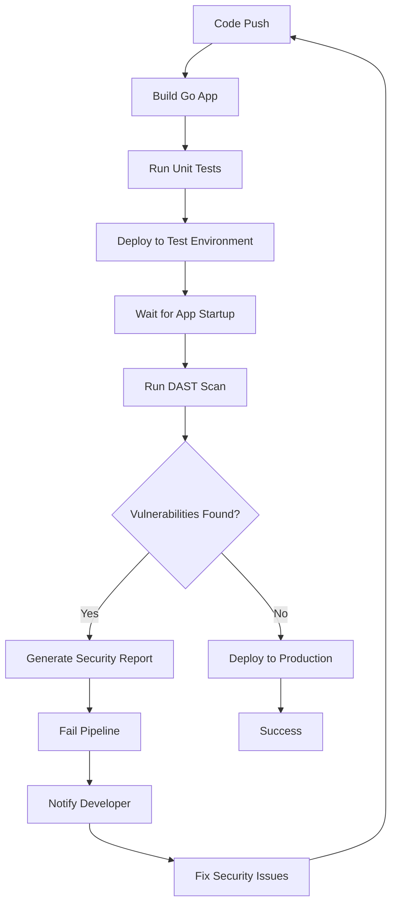

# Dynamic Application Security Testing for GoLang CI Checks

---

## Document Metadata 

| **Author**   | **Created on** | **Version** | **Last updated on** | **Level** | **Reviewer**  |
|--------------|----------------|-------------|---------------------|-----------|---------------|
|Ashutosh Kumar| 2025-08-18     | 1.0          | 2025-08-18         | Internal  |Siddharth Pawar/Sahil Gupta|

---

## Table of Contents
1. [Introduction](#introduction)
2. [What is DAST?](#what-is-dast)
3. [Why DAST for Golang?](#why-dast-for-golang)
4. [Workflow Diagram](#workflow-diagram)
5. [DAST Tools for Golang Applications](#dast-tools-for-golang-applications)
6. [Tool Comparison](#tool-comparison)
7. [Advantages](#advantages)
8. [Best Practices](#best-practices)
9. [Recommendations & Conclusion](#recommendations--conclusion)
10. [Contact Information](#contact-information)
11. [References](#references)

---

## Introduction

This documentation provides comprehensive details about Dynamic Application Security Testing (DAST) for Golang applications. It covers tools, processes, and best practices for implementing automated security testing in development workflows.

---

## What is DAST?

Dynamic Application Security Testing (DAST) is a black-box security testing approach that:

- **Tests running applications** in their operational environment
- **Simulates external attacks** without access to source code
- **Identifies runtime vulnerabilities** that may not be visible in static analysis
- **Provides real-time security assessment** of web applications and APIs
- **Focuses on HTTP/HTTPS traffic analysis** and input validation testing

### Key Characteristics:
- **Runtime Testing**: Applications must be running and accessible
- **Black-box Approach**: No source code knowledge required
- **Automated Scanning**: Systematic vulnerability detection
- **Production-like Environment**: Tests in realistic conditions

---

## Why DAST for Golang?

| Golang Security Need | DAST Solution |
|----------------------|---------------|
| HTTP server vulnerabilities | Tests net/http package implementations |
| API endpoint security | Validates REST/GraphQL APIs |
| Input validation issues | Tests JSON/form parameter handling |
| Authentication flaws | Verifies access control mechanisms |
| Session management | Tests cookie/token security |
| Third-party dependencies | Runtime vulnerability detection |

---

## Workflow Diagram

---

## DAST Tools for Golang Applications

| Tool | Type | Cost | Go Support | CI/CD Ready | Key Features |
|------|------|------|------------|-------------|--------------|
| **OWASP ZAP** | Open Source | Free | Excellent | Yes | API testing, plugin ecosystem, scripting |
| **Burp Suite Pro** | Commercial | High | Excellent | Limited | Manual testing, extensions, HTTP/2 support |
| **Acunetix** | Commercial | Medium | Good | Yes | Fast scanning, framework detection, low FP |
| **Rapid7 InsightAppSec** | SaaS | Medium | Good | Yes | Cloud-based, scalable, microservices support |
| **Veracode DAST** | SaaS | High | Good | Yes | Enterprise-grade, compliance, policy mgmt |
| **Netsparker** | Commercial | Medium | Good | Yes | Automated verification, proof-based scanning |

---

## Tool Comparison

| Feature | OWASP ZAP | Burp Suite | Acunetix | InsightAppSec | Veracode |
|---------|-----------|------------|----------|---------------|----------|
| **Cost** | Free | High | Medium | Medium | High |
| **Go Support** | Excellent | Excellent | Good | Good | Good |
| **CI/CD Ready** | Yes | Limited | Yes | Yes | Yes |
| **API Testing** | Excellent | Excellent | Good | Good | Good |
| **Ease of Use** | Medium | Hard | Easy | Easy | Easy |
| **Reporting** | Good | Good | Excellent | Good | Excellent |

---

## Advantages

| Advantage | Description | DevOps Value |
|-----------|-------------|--------------|
| **Runtime Testing** | Tests live applications in production-like environment | Validates actual deployment security |
| **Black-box Approach** | No source code access needed | Works with any deployment method |
| **Attack Simulation** | Mimics real attacker behavior | Provides realistic security assessment |
| **Technology Agnostic** | Tests complete application stack | Covers all components and integrations |
| **Compliance Ready** | Supports OWASP Top 10, PCI DSS standards | Meets audit requirements |
| **CI/CD Integration** | Automated security gates | Prevents vulnerable code deployment |
| **External Perspective** | Tests from outside attacker viewpoint | Identifies perimeter security gaps |
| **Configuration Testing** | Finds environment-specific issues | Catches deployment misconfigurations |

---

## Best Practices

| Category | Practice |
|----------|----------|
| **Environment Setup** | Use dedicated test environment, mirror production |
| **Scan Configuration** | Define clear scope, configure authentication |
| **Scheduling** | Weekly dev scans, pre-release testing |
| **Results Management** | Set failure thresholds, track false positives |
| **Team Integration** | Train developers, establish security champions |
| **Automation** | Integrate with Jenkins/GitLab/GitHub Actions |

---

## Recommendations & Conclusion

### Primary Recommendation: **OWASP ZAP**

**Why OWASP ZAP:**
- Cost-effective (free)
- Excellent Go framework support
- Strong CI/CD integration capabilities
- Active community and documentation
- Docker-ready for containerized deployments

### Secondary Options:
- **Burp Suite Pro**: For advanced manual security testing
- **Veracode DAST**: For enterprise compliance requirements

DAST is essential for Go application security. OWASP ZAP provides the best balance of features, cost, and Go-specific support for most teams.

---

## **Proof of Concept (POC)**

Follow this link for "DAST for golang CI Checks" POC.
  > [DAST for golang CI Checks POC](https://github.com/Snaatak-Cloudops-Crew/documentation/blob/SCRUM-181-Ashutosh/Applications/CI-Design/Java-CI-Checks/Static-Code-Analysis/POC/README.md)

---

## Contact Information

| Name            | Email Address                         |
|-----------------|---------------------------------------|
| Ashutosh Kumar  | ashutosh.kumar.snaatak@mygurukulam.co |

---

## References

| Category | Resource | URL |
|----------|----------|-----|
| **Standards** | OWASP DAST Guide | https://owasp.org/www-community/Vulnerability_Scanning_Tools |
| | OWASP Top 10 | https://owasp.org/www-project-top-ten/ |
| **Tools** | OWASP ZAP Docs | https://www.zaproxy.org/docs/ |
| | Burp Suite Guide | https://portswigger.net/burp/documentation |
| **Golang** | Go Security Policy | https://golang.org/security |
| **Compliance** | PCI DSS Standards | https://www.pcisecuritystandards.org/ |
