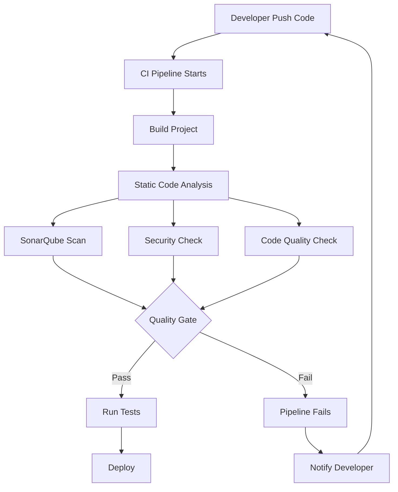

# Static Code Analysis for Java CI Checks

---

## Document Metadata 

| **Author**   | **Created on** | **Version** | **Last updated on** | **Level** | **Reviewer**  |
|--------------|----------------|-------------|---------------------|-----------|---------------|
|Ashutosh Kumar| 2025-08-13     | 1.0          | 2025-08-13         | Internal  |Siddharth Pawar/Sahil Gupta|

---

## Table of Contents
- [Introduction](#introduction)
- [What is Static Code Analysis?](#what-is-static-code-analysis)
- [Why Static Code Analysis?](#why-static-code-analysis)
- [Workflow Diagram](#workflow-diagram)
- [Popular Tools](#popular-tools)
- [Tool Comparison](#tool-comparison)
- [Advantages](#advantages)
- [Best Practices](#best-practices)
- [Recommendations & Conclusion](#recommendations--conclusion)
- [Proof of Concept (POC)](#proof-of-concept-poc)
- [Contact Information](#contact-information)
- [References](#references)

---

## Introduction

This documentation provides a comprehensive guide to implementing static code analysis in Java applications within CI/CD pipelines. It covers various tools, best practices, and recommendations for maintaining high code quality standards in enterprise and learning environments.

Static code analysis is a critical component of modern software development that helps identify potential issues, security vulnerabilities, and code quality problems before they reach production.

---

## What is Static Code Analysis?

Static code analysis is the process of examining source code without executing it to identify:
- **Code quality issues** (complexity, maintainability)
- **Security vulnerabilities** (SQL injection, XSS, etc.)
- **Coding standard violations** (formatting, naming conventions)
- **Potential bugs** (null pointer exceptions, resource leaks)
- **Performance bottlenecks**
- **Test coverage gaps**

### Key Characteristics:
- Automated examination of source code
- No code execution required
- Early detection of issues in development cycle
- Integration with CI/CD pipelines
- Customizable rules and standards

---

## Why Static Code Analysis?

| Benefits | Description |
|----------|-------------|
| Reduced Development Costs | Early bug detection is 10x cheaper than fixing in production |
| Improved Security | Identifies vulnerabilities before deployment |
| Enhanced Code Quality | Maintains consistent coding standards |
| Faster Time to Market | Automated quality gates reduce manual review time |
| Risk Mitigation | Prevents critical issues from reaching production |
| Automated Quality Assurance | Consistent code review process |
| Knowledge Sharing | Enforces best practices across teams |
| Maintainability | Easier code maintenance and updates |
| Documentation | Generates quality metrics and reports |
| Compliance | Meets industry standards (OWASP, CWE, etc.) |

---

## Workflow Diagram

---

## Popular Tools

| Tool | Description | Key Features | Pros | Cons |
|------|-------------|--------------|------|------|
| **SonarQube (Community Edition)** | Comprehensive code quality platform with extensive Java support | Security vulnerability detection, Code smell identification, Test coverage analysis, Technical debt assessment, IDE integration | Industry standard, Extensive rule sets, Great reporting, Active community | Resource intensive, Setup complexity, Limited languages in free version |
| **SpotBugs** | Successor to FindBugs, focuses on finding bugs in Java programs | 400+ bug patterns, Low false positive rate, IDE and build tool integration, Custom rule development | Lightweight, High accuracy, Easy integration, Open source | Limited to bug detection, No security focus, Basic reporting |
| **Checkstyle** | Ensures Java code adheres to coding standards and conventions | Configurable coding standards, Google and Sun coding conventions, Custom rule creation, Maven/Gradle integration | Highly customizable, Fast execution, Wide adoption, Detailed documentation | Only coding standards, No bug detection, Can be overly strict |
| **PMD** | Source code analyzer that finds programming flaws and code smells | Copy-paste detection, Unused code identification, Performance issues detection, Custom rule development | Multiple language support, Extensive rule sets, Good performance, Active development | Can be noisy, Configuration complexity, False positives |
| **Error Prone** | Google's static analysis tool that catches common Java mistakes | Compile-time error detection, Automatic fixes, Custom bug patterns, Google's battle-tested rules | High-quality rules, Automatic fixes, Low false positives, Google backing | Limited scope, Requires Java 8+, Less comprehensive |

---

## Tool Comparison

| Feature | SonarQube CE | SpotBugs | Checkstyle | PMD | Error Prone |
|---------|--------------|----------|------------|-----|-------------|
| **Cost** | Free | Free | Free | Free | Free |
| **Security Analysis** | ✅ | ❌ | ❌ | Limited | ❌ |
| **Code Quality** | ✅ | ✅ | ✅ | ✅ | ✅ |
| **Coding Standards** | ✅ | ❌ | ✅ | Limited | ❌ |
| **Test Coverage** | ✅ | ❌ | ❌ | ❌ | ❌ |
| **IDE Integration** | ✅ | ✅ | ✅ | ✅ | ✅ |
| **CI/CD Integration** | ✅ | ✅ | ✅ | ✅ | ✅ |
| **Reporting** | Excellent | Good | Basic | Good | Basic |
| **Learning Curve** | Medium | Easy | Easy | Easy | Easy |
| **Industry Adoption** | Very High | High | Very High | High | Medium |
| **Performance** | Medium | Fast | Fast | Fast | Fast |

---

## Advantages

| Stakeholder | Advantage | Description |
|-------------|-----------|-------------|
| **Development Teams** | Early Issue Detection | Catch problems before code review |
| | Consistent Quality | Uniform code standards across projects |
| | Learning Tool | Helps developers improve coding skills |
| | Automated Feedback | Immediate feedback on code quality |
| **Organizations** | Risk Reduction | Minimize security and quality risks |
| | Cost Savings | Reduce debugging and maintenance costs |
| | Compliance | Meet industry standards and regulations |
| | Productivity | Faster development cycles with automated checks |
| **CI/CD Pipelines** | Quality Gates | Prevent poor code from advancing |
| | Automated Reporting | Generate quality metrics automatically |
| | Integration | Seamless integration with existing tools |
| | Scalability | Handle multiple projects and repositories |

---

## Best Practices

| Category | Practice | Description |
|----------|----------|-------------|
| **Tool Selection & Configuration** | Start Simple | Begin with basic tools like Checkstyle and SpotBugs |
| | Gradual Adoption | Introduce rules incrementally to avoid overwhelming developers |
| | Custom Rules | Create organization-specific rules for business logic |
| | Regular Updates | Keep tools and rule sets updated |
| **CI/CD Integration** | Fail Fast | Configure pipeline to fail on critical issues |
| | Quality Gates | Set appropriate thresholds for different environments |
| | Parallel Execution | Run analysis in parallel with builds when possible |
| | Caching | Use caching to improve analysis performance |
| **Team Adoption** | Training | Provide training on tool usage and rule meanings |
| | Documentation | Maintain clear documentation on standards and exceptions |
| | Feedback Loop | Encourage developer feedback on rules and findings |
| | Champions | Identify team champions to drive adoption |
| **Reporting & Metrics** | Dashboard | Create centralized quality dashboards |
| | Trend Analysis | Track quality metrics over time |
| | Actionable Reports | Focus on actionable findings |
| | Regular Reviews | Conduct regular code quality reviews |
| **Maintenance** | Rule Tuning | Regularly tune rules to reduce noise |
| | False Positive Handling | Implement process for handling false positives |
| | Exception Management | Manage rule exceptions appropriately |
| | Performance Monitoring | Monitor tool performance and optimize as needed |

---

## Recommendations & Conclusion

### Recommended Tool Stack for Java Projects:

#### **Primary Recommendation: SonarQube Community Edition**

After comprehensive analysis, **SonarQube Community Edition** is the recommended choice for Java applications because:

| Criteria | Justification |
|----------|---------------|
| **Comprehensive Coverage** | Provides security, quality, and maintainability analysis in one platform |
| **Industry Standard** | Widely adopted in enterprise environments |
| **Learning Value** | Excellent educational tool with detailed explanations |
| **Free & Feature-Rich** | Community edition offers substantial functionality at no cost |
| **Extensible** | Can be enhanced with additional tools as needs grow |

#### **Complementary Tools**:

| Tool | Purpose | Integration |
|------|---------|-------------|
| **Checkstyle** | Coding standards enforcement | Native SonarQube integration |
| **SpotBugs** | Additional bug detection patterns | Plugin available for SonarQube |
| **JaCoCo** | Test coverage reporting | Built-in SonarQube integration |

The combination of comprehensive coverage, industry adoption, and educational value makes SonarQube Community Edition the optimal choice for Java static code analysis in learning and professional environments.

---

## **Proof of Concept (POC)**

Follow this link for "Static Code Analysis for Java CI Checks" POC.
  > [Static Code Analysis for Java CI Checks POC](https://github.com/Snaatak-Cloudops-Crew/documentation/blob/SCRUM-135-Ashutosh/Application-CI-Design/Generic-CI-operation/Licence-Scanning/POC.md)

---

## Contact Information

| Name            | Email Address                         |
|-----------------|---------------------------------------|
| Ashutosh Kumar  | ashutosh.kumar.snaatak@mygurukulam.co |

---

## References

| Reference | Description |
|----------|-------------|
| [SonarQube Documentation](https://docs.sonarqube.org/) | Complete guide to SonarQube installation, configuration, and usage |
| [SpotBugs Manual](https://spotbugs.readthedocs.io/) | Comprehensive documentation for SpotBugs bug detection tool |
| [Checkstyle Documentation](https://checkstyle.org/) | Official guide for Java coding standards enforcement |
| [PMD User Guide](https://pmd.github.io/) | Complete documentation for PMD static analysis tool |
| [Error Prone Documentation](https://errorprone.info/) | Google's static analysis tool documentation and usage guide |
