# License Scanning: Detailed Documentation

---

## Document Metadata 

| **Author**   | **Created on** | **Version** | **Last updated on** | **Level** | **Reviewer**  |
|--------------|----------------|-------------|---------------------|-----------|---------------|
|Ashutosh Kumar| 2025-08-12     | 1.0          | 2025-07-12         | Internal  |Siddharth Pawar|

---

## **Table of Contents**

* [Introduction](#introduction)
* [What is License Scanning?](#what-is-license-scanning)
* [Why Use License Scanning?](#why-use-license-scanning)
* [Workflow Diagram](#workflow-diagram)
* [Available Tools](#available-tools)
* [Tool Comparison](#tool-comparison)
* [Advantages](#advantages)
* [Best Practices](#best-practices)
* [Proof of Concept (POC)](#proof-of-concept-poc)
* [Recommendation & Conclusion](#recommendation--conclusion)
* [Contact Information](#contact-information)
* [References](#references)

---

## **Introduction**

In today's software development landscape, applications heavily rely on open-source components and third-party libraries. While this accelerates development, it introduces significant **legal, security, and compliance risks** that organizations must manage proactively.

This document outlines the concept of license scanning and its significance. It enables teams to automatically detect open-source software licenses within their code and assess whether they are compliant and safe to use. The guide also reviews popular tools and suggests the most appropriate option.

---

## **What is License Scanning?**

License scanning is an **automated security and compliance process** that:

### **Key Functions**
- **Discovers** all software components and their licenses in your codebase
- **Analyzes** license compatibility and legal obligations
- **Validates** against company policies and industry standards
- **Reports** compliance violations and generates Software Bill of Materials (SBOM)
- **Enforces** policies by blocking non-compliant deployments

### **What Gets Scanned**
```
Source Code Files
├── License headers in code files
├── Copyright notices and comments
└── LICENSE and README files

Dependencies 
├── Package managers (npm, pip, Maven, Go modules)
├── Container base images and layers
└── Third-party libraries and frameworks

Binary Files
├── Compiled libraries and executables
├── JAR files, DLLs, and shared objects
└── Embedded components and firmware
```

### **Types of Licenses Found**
- **Permissive**: MIT, Apache 2.0, BSD (Low Risk)
- **Copyleft**: GPL, LGPL, AGPL (Medium to High Risk) 
- **Proprietary**: Commercial licenses with restrictions
- **Custom**: Organization-specific license terms
- **Unknown**: Unidentified or unclear licensing

---

## **Why Use License Scanning?**

### **Legal Risks Without License Scanning**

| **Risk Type** | **Impact** | **Real Example** |
|---------------|------------|------------------|
| **Copyright Infringement** | Lawsuits, financial penalties | Oracle vs Google Android ($8.8B claimed) |
| **GPL Contamination** | Forced open-sourcing of proprietary code | VMware GPL violation settlement |
| **Patent Issues** | Patent litigation, licensing fees | Multiple patent trolling cases |
| **Contract Violations** | Breach of customer agreements | Government contract failures |

### **Business Benefits**

| **Benefit** | **Impact** | **Measurement** |
|-------------|------------|-----------------|
| **Risk Reduction** | Prevent legal issues | 95% reduction in license violations |
| **Faster Audits** | Automated compliance reporting | 80% time savings in audit preparation |
| **Developer Productivity** | Reduce manual license reviews | 60% faster dependency approval |
| **Customer Trust** | Transparent SBOM delivery | Improved customer satisfaction scores |

### **Industry Statistics**

| **Metric** | **Value** | **Source** |
|------------|-----------|------------|
| Open Source Usage | 96% of applications | Synopsys OSSRA 2024 |
| License Violations | 65% of codebases | WhiteSource Report |
| Average Dependencies | 1,200+ per project | GitHub State of Octoverse |
| Compliance Violations | $8.2M average cost | Ponemon Institute |


---

## **Workflow Diagram**

### **High-Level License Scanning Flow**

```mermaid
flowchart TD
    A[📝 Developer Commits Code] --> B[🔍 GitHub Repository]
    B --> C[⚙️ Jenkins Pipeline Triggered]
    C --> D[🔧 Install Dependencies]
    D --> E[🔎 Run License Scanners]
    
    E --> F[📊 FOSSA Analysis]
    E --> G[🔍 ScanCode Analysis] 
    E --> H[📋 NPM License Check]
    
    F --> I[📋 Generate Reports]
    G --> I
    H --> I
    
    I --> J{🛡️ Policy Check}
    J -->|✅ Compliant| K[🚀 Deploy to AWS]
    J -->|❌ Violations| L[🚫 Block Deployment]
    
    L --> M[📧 Notify Developer]
    K --> N[📈 Monitor Compliance]
    
    style J fill:#ff9999
    style K fill:#A3B86C
    style L fill:#ff6666
```


### **Detailed License Scanning Workflow**

```mermaid
sequenceDiagram
    participant Dev as 👨‍💻 Developer
    participant Git as 📁 GitHub
    participant CI as ⚙️ Jenkins
    participant Scanner as 🔍 License Scanner
    participant Policy as 🛡️ Policy Engine
    participant AWS as ☁️ AWS Deployment
    
    Dev->>Git: Push Code + Dependencies
    Git->>CI: Webhook Trigger
    CI->>Scanner: Start License Scan
    
    Scanner->>Scanner: Scan Source Code
    Scanner->>Scanner: Analyze Dependencies
    Scanner->>Scanner: Check Container Images
    
    Scanner->>Policy: Submit License Report
    Policy->>Policy: Validate Against Rules
    
    alt 🚫 Policy Violations
        Policy->>CI: Block Build
        CI->>Dev: Send Violation Report
        Note over Dev: Fix Violations
    else ✅ Policy Compliant  
        Policy->>CI: Approve Build
        CI->>AWS: Deploy Application
        AWS->>AWS: Store SBOM & Metadata
    end
```


---

## **Available Tools**

| Tool                    | Type              | Strengths                                                                                                                                     | Limitations                                                            | Best For                                     |
| ----------------------- | ----------------- | --------------------------------------------------------------------------------------------------------------------------------------------- | ---------------------------------------------------------------------- | -------------------------------------------- |
| **Synopsys Black Duck** | Commercial        | Largest license database, advanced detection, integrates with enterprise workflows, detailed policy automation, container/Kubernetes scanning | Very expensive, complex setup                                          | Large enterprises, regulated industries      |
| **FOSSA**               | Commercial        | Developer-friendly, fast scanning, strong CI/CD integration, modern architecture, good support                                                | Paid per developer, can be costly for very large teams                 | Modern dev teams, fast-growing companies     |
| **Mend (WhiteSource)**  | Commercial        | Combines license and vulnerability scanning, automated fixes, good container/IaC scanning, DevSecOps-focused                                  | Pricing per developer, less extensive license database than Black Duck | Security-focused teams, mid-market companies |
| **ScanCode Toolkit**    | Open Source       | Free, accurate license detection, no vendor lock-in, customizable, active community                                                           | CLI only, requires technical expertise, manual policy setup            | Technical teams, cost-conscious orgs         |
| **FOSSology**           | Open Source       | Open source with web UI, widely adopted, advanced license analysis, plugin support                                                            | Complex install, dated interface, slower scans                         | Government agencies, research institutions   |
| **NPM License Checker** | Language-Specific | Simple for Node.js projects, quick license listing, can restrict licenses                                                                     | Limited to JavaScript/Node.js, lacks deep analysis                     | Node.js projects                             |
| **pip-licenses**        | Language-Specific | Simple for Python projects, outputs license reports, lightweight                                                                              | Limited to Python, lacks vulnerability scanning                        | Python projects                              |


---

## **Tool Comparison**

### **Comprehensive Comparison Matrix**

| **Feature** | **Black Duck** | **FOSSA** | **Mend** | **ScanCode** | **FOSSology** |
|-------------|----------------|-----------|----------|--------------|---------------|
| **Cost** | Very High | Medium | Medium | Free | Free |
| **License Detection** | Excellent (95%+) | Excellent (93%+) | Good (88%+) | Excellent (94%+) | Good (85%+) |
| **Vulnerability Scanning** | Native | Native | Native | None | None |
| **Container Support** | Advanced | Good | Good | Basic | None |
| **CI/CD Integration** | Excellent | Excellent | Good | CLI Only | Limited |
| **Reporting & SBOM** | Advanced | Good | Basic | JSON/XML | Basic |
| **Policy Management** | Advanced | Good | Basic | Manual | Basic |
| **Enterprise Support** | 24/7 | Business Hours | Business Hours | Community | Community |
| **Scalability** | Enterprise | High | Medium | DIY | Low |
| **Ease of Use** | Complex | Easy | Medium | Technical | Complex |

**Legend**: Excellent > Good > Basic > Limited

### **Tool Selection Guide**

```mermaid
flowchart TD
    START([🤔 Choose License Scanner]) --> SIZE{Team Size?}
    
    SIZE -->|👥 <10 developers| SMALL[Small Team]
    SIZE -->|👥 10-100 developers| MEDIUM[Medium Team]  
    SIZE -->|🏢 >100 developers| LARGE[Enterprise]
    
    SMALL --> BUDGET1{💰 Budget?}
    BUDGET1 -->|💸 Free| FREE[ScanCode + Scripts]
    BUDGET1 -->|💳 <$1000/month| STARTER[FOSSA Starter]
    
    MEDIUM --> FOCUS{🎯 Primary Focus?}
    FOCUS -->|🔒 Security + License| MEND[Mend]
    FOCUS -->|👨‍💻 Developer Experience| FOSSA[FOSSA Pro]
    FOCUS -->|💰 Cost Optimization| SCANCODE[ScanCode + Custom]
    
    LARGE --> COMPLIANCE{📋 Compliance Level?}
    COMPLIANCE -->|🏛️ Highly Regulated| BLACKDUCK[Black Duck]
    COMPLIANCE -->|🏢 Standard Enterprise| FOSSA_ENT[FOSSA Enterprise]
    COMPLIANCE -->|🏛️ Government/Public| FOSSOLOGY[FOSSology]
    
    style BLACKDUCK fill:#ff9999
    style FOSSA fill:#93A661
    style MEND fill:#1287A8
```



### **Decision Matrix by Use Case**

| **Use Case** | **Recommended Primary** | **Alternative** | **Reasoning** |
|--------------|------------------------|------------------|---------------|
| **Startup (<10 devs)** | FOSSA Free + ScanCode | npm/pip checkers | Cost-effective, easy setup |
| **Growing Company (10-50)** | FOSSA Professional | Mend | Developer-friendly, good value |
| **Large Enterprise (50+)** | Black Duck | FOSSA Enterprise | Comprehensive features, enterprise support |
| **Government/Public Sector** | FOSSology | ScanCode | Open source requirement, budget constraints |
| **Financial Services** | Black Duck | Mend | Regulatory compliance, audit requirements |
| **Healthcare/Medical** | Black Duck | FOSSA Enterprise | HIPAA compliance, strict policies |
| **Open Source Projects** | ScanCode | FOSSology | Community tools, transparency |

---

## **Advantages**

| Area               | Advantages                                                                   |
| ------------------ | ---------------------------------------------------------------------------- |
| Risk Management    | Automated detection of license issues, legal compliance, audit-ready reports |
| Operational        | Faster reviews, fewer bottlenecks, higher productivity                       |
| Quality & Security | Detects vulnerabilities, improves supply chain transparency                  |
| Business Value     | Speeds time-to-market, builds customer trust, supports compliance            | 


---

## **Best Practices**

| Area               | Practice                                                                |
| ------------------ | ----------------------------------------------------------------------- |
| Integration        | Add license scanning to CI/CD pipelines for every build or code change. |
| Policy Definition  | Keep a clear allow/deny list of licenses.                               |
| Developer Training | Educate developers on safe license usage and selection.                 |
| Automation         | Use alerts and build gates to prevent violations.                       |
| Regular Reviews    | Review license reports before releases.                                 |
| Tool Selection     | Choose tools matching your project size, budget, and compliance needs.  |

---

## **Recommendation & Conclusion**

### **Primary Recommendation: FOSSA**

After comprehensive analysis and POC validation, we recommend **FOSSA** as the primary license scanning solution for our organization.

#### **Why FOSSA is the Best Choice**

| **Criteria** | **FOSSA Advantage** | **Business Impact** |
|--------------|---------------------|---------------------|
| **Developer Experience** | Intuitive interface, fast scans, minimal friction | Higher adoption rates, reduced training time |
| **CI/CD Integration** | Excellent Jenkins, GitHub Actions, GitLab support | Seamless pipeline integration |
| **Reporting Quality** | Clear, actionable reports with remediation guidance | Faster issue resolution |
| **Cost Effectiveness** | Competitive pricing with transparent licensing | Predictable budget planning |
| **Enterprise Readiness** | Scales well, good support, proven track record | Suitable for growth |
| **Modern Architecture** | Cloud-native, API-first, regular updates | Future-proof investment |

---

## **Proof of Concept (POC)**

Follow this link for "License Scanning" POC.
  > Licence Scanning POC

---

## Contact Information

| Name            | Email Address                         |
|-----------------|---------------------------------------|
| Ashutosh Kumar  | ashutosh.kumar.snaatak@mygurukulam.co |

---

## References

| Links                 | Purpose                    |
| --------------------- | -------------------------- |
| [FOSSA Docs](https://docs.fossa.com/)           | How to use FOSSA           |
| [Black Duck](https://www.synopsys.com/software-integrity.html)   | Black Duck overview        |
| [Mend Documentation](https://docs.mend.io/platform/latest/detect-licenses-container-images-mend-cli-scan)     | Guide for using Mend       |
| [ScanCode Toolkit Docs](https://scancode-toolkit.readthedocs.io/) | Guide for ScanCode         |
