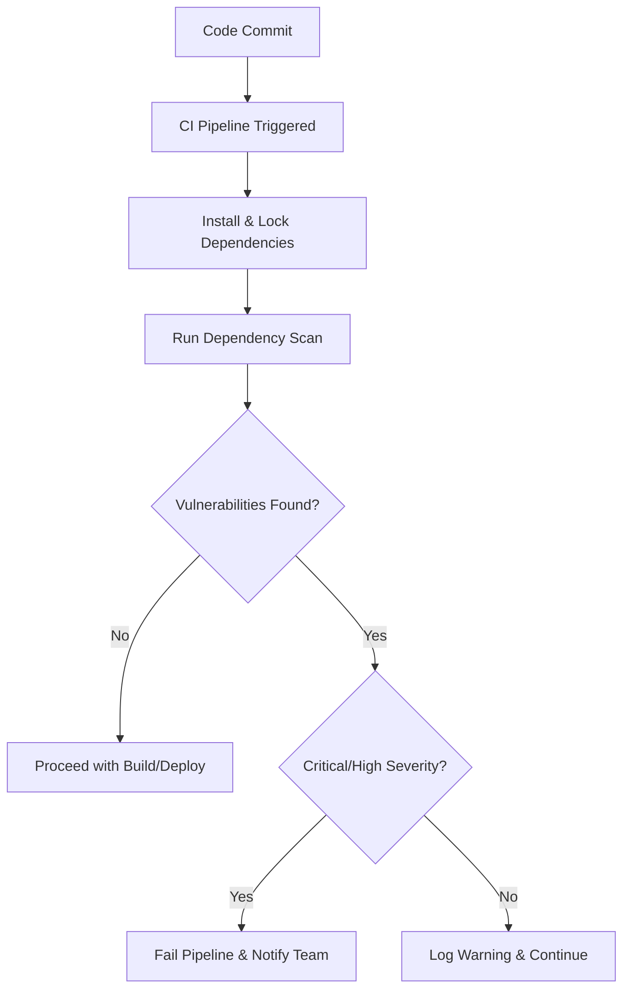

# Python CI Checks for Dependency Scanning

---

## Document Metadata 

| **Author**   | **Created on** | **Version** | **Last updated on** | **Level** | **Reviewer**  |
|--------------|----------------|-------------|---------------------|-----------|---------------|
|Ashutosh Kumar| 2025-08-13     | 1.0          | 2025-08-13         | Internal  |Siddharth Pawar/Sahil Gupta|

---

## Table of Contents
- [Introduction](#introduction)
- [What is Dependency Scanning?](#what-is-dependency-scanning)
- [Why Dependency Scanning Matters](#why-dependency-scanning-matters)
- [Workflow Diagram](#workflow-diagram)
- [Available Tools](#available-tools)
- [Tool Comparison](#tool-comparison)
- [Advantages](#advantages)
- [Best Practices](#best-practices)
- [Recommendations & Conclusion](#recommendations--conclusion)
- [Contact Information](#contact-information)
- [References](#references)
---

## Introduction

Dependency scanning is a critical component of modern software development that helps identify security vulnerabilities, licensing issues, and outdated packages in your Python applications. This documentation provides a comprehensive guide to implementing dependency scanning in your Python CI/CD pipeline.

As Python applications rely heavily on third-party packages from PyPI, ensuring these dependencies are secure and up-to-date is essential for maintaining application security and compliance.

---

## What is Dependency Scanning?

Dependency scanning is an automated security testing practice that:

- **Analyzes project dependencies** for known security vulnerabilities
- **Checks for outdated packages** that may contain security flaws
- **Identifies licensing conflicts** and compliance issues
- **Monitors dependency health** and maintenance status
- **Provides remediation suggestions** for identified issues

### Key Components:
- **Vulnerability Database Integration**: Connects with CVE databases and security advisories
- **Package Analysis**: Examines both direct and transitive dependencies
- **Risk Assessment**: Prioritizes vulnerabilities based on severity and exploitability
- **Reporting**: Generates actionable reports with remediation guidance

---

## Why Dependency Scanning Matters

| Category            | Key Points                                                                                                                                             |
| ------------------- | ------------------------------------------------------------------------------------------------------------------------------------------------------ |
| **Security Risks**  | - 81% of apps have vulnerable dependencies   - Avg. 70+ vulnerabilities per app   - Rising supply chain attacks                                  |
| **Business Impact** | - Compliance: SOC 2, ISO 27001, PCI DSS   - Risk mitigation: prevent breaches   - Cost: early fixes 100x cheaper   - Brand protection & trust |
| **Dev Benefits**    | - Automated security in DevOps   - Developer security awareness   - Continuous monitoring of dependencies   - Manage technical debt           |

---

## Workflow Diagram

---

## Available Tools

| Tool                                       | Type / Usage                | Key Features                                                                                      |
| ------------------------------------------ | --------------------------- | ------------------------------------------------------------------------------------------------- |
| **Safety** (Basic)                       | CLI scanner                 | - Uses PyUp DB   - JSON output for CI   - Simple & free tier available                      |
| **Bandit**  (Code Scan)                   | Static analysis             | - Finds common security issues   - Plugin-based   - Configurable rules   - SARIF support |
| **pip-audit**  (Recommended)             | Official PyPA tool          | - Fast & lightweight   - Multiple formats   - Good CI/CD integration                        |
| **Snyk**  (Pro)                         | Advanced vulnerability mgmt | - Rich DB   - License checks   - Auto-fix PRs   - Detailed reports                       |
| **OWASP Dependency-Check**  (Enterprise) | Multi-language scanner      | - NIST NVD integration   - Broad reports   - Jenkins/CI integration                         |
| **GitHub Dependabot**  (Integrated)     | GitHub-native automation    | - Auto PRs   - Security advisory link   - Free for public repos                             |

---

## Tool Comparison

| Tool | Cost | Setup Complexity | Database Coverage | CI Integration | License Scan | Fix Suggestions |
|------|------|------------------|-------------------|----------------|--------------|-----------------|
| **Safety** | Free/Paid | Low | Good | Yes | No | No |
| **pip-audit** | Free | Low | Good | Yes | No | No |
| **Bandit** | Free | Medium | N/A | Yes | No | No |
| **Snyk** | Free/Paid | Medium | Excellent | Yes | Yes | Yes |
| **OWASP DC** | Free | High | Excellent | Yes | Yes | No |
| **Dependabot** | Free/Paid | Low | Good | Yes | No | Yes |

---

## Advantages

| Benefit Area    | Key Points                                                                                                                                             |
| --------------- | ------------------------------------------------------------------------------------------------------------------------------------------------------ |
| **Security**    | - Detect vulnerabilities early   - Continuous dependency monitoring   - Meet compliance requirements   - Protect against supply chain attacks |
| **Operational** | - Automate CI/CD integration   - Improve developer productivity   - Prioritize critical risks   - Maintain audit/compliance history           |
| **Cost**        | - Reduce breaches & downtime   - Optimize security resource use   - Lower cyber insurance premiums   - Build customer trust & reputation      |

---

## Best Practices

| Area                            | Key Actions / Tools                                                                                                                  | Recommended For                         |
| ------------------------------- | ------------------------------------------------------------------------------------------------------------------------------------ | --------------------------------------- |
| **Start Simple → Scale**        | Phase 1: Basic scan with `pip-audit`   Phase 2: CI integration with reports   Phase 3: Advanced tools like Snyk                | All teams (start small, grow as needed) |
| **Multi-Layer Security**        | Bandit for static analysis   pip-audit / Safety for dependency scanning   License compliance   Container scanning if needed | Mid–large teams / enterprise            |
| **CI/CD Integration (Jenkins)** | Add stages for installing dependencies, running `pip-audit`, and running `bandit`   Collect JSON reports for visibility           | Teams using Jenkins pipelines           |
| **Severity Thresholds**         | Fail on high/critical   Warn on medium   Ignore low/info                                                                       | Teams balancing risk vs productivity    |
| **False Positives**             | Use `.pip-audit.toml` or equivalent config   Ignore only with justification                                                       | Mature teams / regulated environments   |
| **Monitoring & Updates**        | Weekly dependency updates   Monthly vulnerability reviews   Quarterly tool updates                                             | Ongoing best practice for all teams     |
| **Team Training**               | Security awareness sessions   CI/CD tool training   Incident response drills                                                   | All dev & DevOps teams                  |

---

## Recommendations & Conclusion

| Project Size           | Recommended Stack                                                                                                                                             | Implementation Time | Cost               | Maintenance |
| ---------------------- | ------------------------------------------------------------------------------------------------------------------------------------------------------------- | ------------------- | ------------------ | ----------- |
| **Small / Startup**    | - `pip-audit` (vulnerability scan)   - Dependabot (auto updates)   - Bandit (static analysis)                                                           | 2–4 hours           | Free               | Low         |
| **Medium / Teams**     | - `pip-audit` (backup scan)   - Snyk (fix suggestions)   - CI integration (Jenkins/GitHub Actions)   - SARIF output for dashboards                   | 1–2 days            | \$0–200 / month    | Medium      |
| **Enterprise / Large** | - `pip-audit` (baseline scan)   - Snyk Enterprise or OWASP Dependency-Check   - Multiple scanners (redundancy)   - Custom dashboards & orchestration | 1–2 weeks           | \$500–5000 / month | High        |

#### Universal Best Practices

* **Start early**: Even basic scans add value
* **Fail fast**: Block builds on critical/high vulnerabilities
* **Automate**: Integrate into CI/CD, reduce manual checks
* **Monitor continuously**: Vulnerabilities change daily
* **Train your team**: Awareness = fewer mistakes
* **Document exceptions**: Keep audit trail for ignored findings

### Conclusion

`pip-audit` is an ideal **starting point for Python projects**: fast, free, and easy to integrate. Begin with it, then scale up with additional tools like **Snyk** or **OWASP Dependency-Check** as your project and compliance needs grow. The key is **consistency and automation**, not perfection.

---

## **Proof of Concept (POC)**

Follow this link for "Dependency Scanning for Python CI Checks" POC.
  > [Dependency Scanning for Python CI Checks POC](https://github.com/Snaatak-Cloudops-Crew/documentation/blob/SCRUM-135-Ashutosh/Application-CI-Design/Generic-CI-operation/Licence-Scanning/POC.md)

---

## Contact Information

| Name            | Email Address                         |
|-----------------|---------------------------------------|
| Ashutosh Kumar  | ashutosh.kumar.snaatak@mygurukulam.co |

---

## References

| Category              | Reference                                                                         |
| --------------------- | --------------------------------------------------------------------------------- |
| **Tool Docs**         | [pip-audit Documentation](https://pypi.org/project/pip-audit/)                    |
| **Security Database** | [NIST National Vulnerability Database](https://nvd.nist.gov/)                     |
| **Best Practices**    | [Supply Chain Security (SLSA)](https://slsa.dev/)                                 |
| **Industry Report**   | [Snyk Open Source Security Report](https://snyk.io/reports/open-source-security/) |
