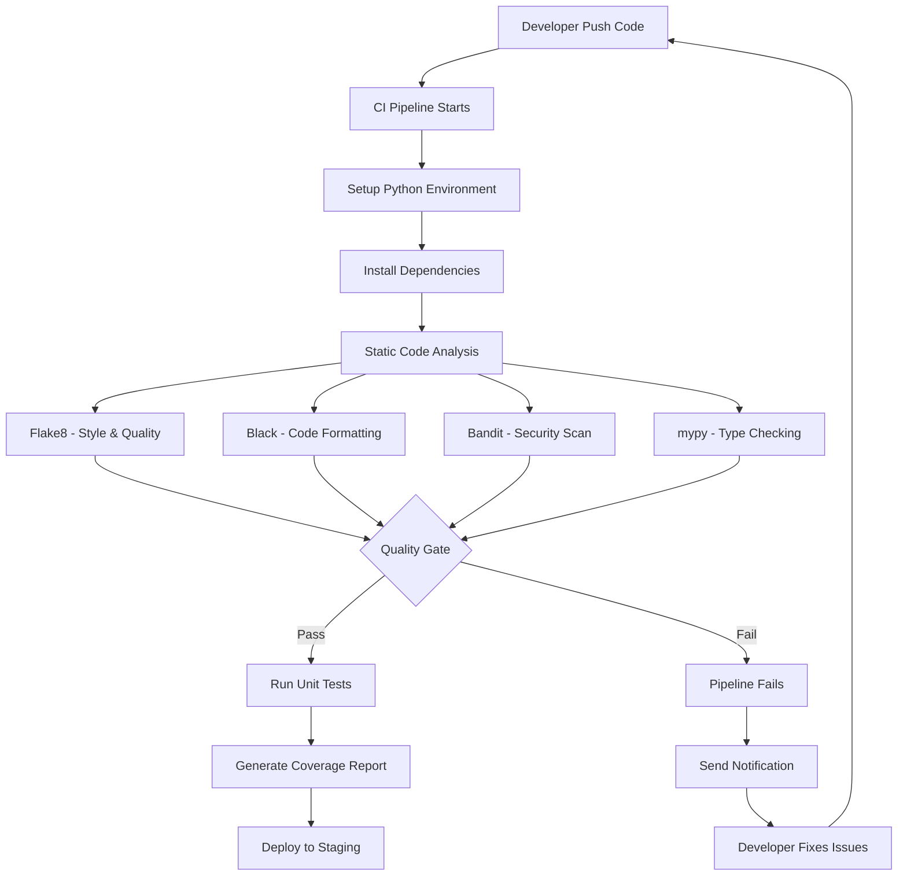

# Static Code Analysis for Python CI Checks

---

## Document Metadata 

| **Author**   | **Created on** | **Version** | **Last updated on** | **Level** | **Reviewer**  |
|--------------|----------------|-------------|---------------------|-----------|---------------|
|Ashutosh Kumar| 2025-08-13     | 1.0          | 2025-08-13         | Internal  |Siddharth Pawar/Sahil Gupta|

---

## Table of Contents
- [Introduction](#introduction)
- [What is Static Code Analysis?](#what-is-static-code-analysis)
- [Why Static Code Analysis?](#why-static-code-analysis)
- [Workflow Diagram](#workflow-diagram)
- [Popular Tools](#popular-tools)
- [Tool Comparison](#tool-comparison)
- [Advantages](#advantages)
- [Best Practices](#best-practices)
- [Recommendations & Conclusion](#recommendations--conclusion)
- [Proof of Concept (POC)](#proof-of-concept-poc)
- [Contact Information](#contact-information)
- [References](#references)

---

## Introduction

This documentation provides a comprehensive guide to implementing static code analysis in Python applications within CI/CD pipelines. It covers various tools, best practices, and recommendations for maintaining high code quality standards in enterprise and learning environments.

Static code analysis is essential for Python development as it helps maintain code quality, enforces PEP 8 standards, identifies security vulnerabilities, and catches potential bugs before they reach production environments.

---

## What is Static Code Analysis?

Static code analysis is the process of examining Python source code without executing it to identify:
- **Code quality issues** (complexity, maintainability, readability)
- **PEP 8 violations** (Python style guide compliance)
- **Security vulnerabilities** (injection attacks, hardcoded secrets)
- **Potential bugs** (undefined variables, import errors, logic issues)
- **Type errors** (when using type hints)
- **Performance bottlenecks** (inefficient patterns)
- **Test coverage gaps**
- **Code duplication**

### Key Characteristics:
- Automated examination of Python source code
- No code execution required
- Early detection of issues in development cycle
- Integration with CI/CD pipelines
- Customizable rules and standards
- Support for Python-specific patterns and idioms

---

## Why Static Code Analysis?

| Benefit | Description |
|---------|-------------|
| Reduced Development Costs | Early bug detection is 10x cheaper than fixing in production |
| Improved Security | Identifies vulnerabilities before deployment |
| Enhanced Code Quality | Maintains consistent coding standards across teams |
| Faster Time to Market | Automated quality gates reduce manual review time |
| Risk Mitigation | Prevents critical issues from reaching production |
| Automated Quality Assurance | Consistent code review process without human intervention |
| Knowledge Sharing | Enforces best practices across development teams |
| Maintainability | Easier code maintenance and future updates |
| Documentation | Generates quality metrics and comprehensive reports |
| PEP 8 Compliance | Ensures adherence to Python coding standards |

---

## Workflow Diagram

---

## Popular Tools

| Tool | Description | Key Features | Pros | Cons |
|------|-------------|--------------|------|------|
| **Flake8** | Lightweight wrapper combining PyFlakes, pycodestyle, and McCabe complexity checker | PEP 8 style checking, Syntax error detection, McCabe complexity analysis, Extensive plugin ecosystem, Fast execution | Fast and lightweight, Easy configuration, Great CI integration, Extensible with plugins | Less comprehensive than Pylint, Basic reporting, No security focus |
| **Black** | Uncompromising Python code formatter that enforces consistent style | Automatic code formatting, Consistent style enforcement, Fast execution, Git integration, Minimal configuration | Eliminates style debates, Very fast execution, Easy adoption, Consistent results | Opinionated formatting, Limited customization options, Not a full analyzer |
| **Pylint** | Comprehensive Python code analyzer with extensive checking capabilities | Code quality scoring (0-10), Error and warning detection, PEP 8 compliance checking, Custom plugin support, Detailed reporting | Very comprehensive analysis, Detailed reporting, Highly configurable, Industry standard | Can be slow on large codebases, Verbose output, Steep learning curve |
| **Bandit** | Security-focused linter designed to find common security issues in Python code | Security vulnerability detection, Common security anti-patterns, JSON/XML reporting formats, Baseline support for legacy code, Low false positive rate | Security focused, Low false positives, Easy CI integration, Good documentation | Limited scope to security, No general quality checks, Requires security knowledge |
| **mypy** | Static type checker for Python that helps catch type-related errors | Type error detection, Gradual typing support, IDE integration, Incremental checking, Protocol support | Catches type errors early, Improves code documentation, Growing adoption, Performance benefits | Requires type hints, Learning curve, Additional development overhead |
| **SonarQube CE** | Multi-language code quality platform with Python support | Security vulnerability analysis, Code quality metrics, Technical debt tracking, Web-based dashboard, Historical trend analysis | Comprehensive analysis, Excellent reporting, Industry standard, Multi-language support | Resource intensive, Complex setup, Limited features in free version |

---

## Tool Comparison

| Feature | Flake8 | Black | Pylint | Bandit | mypy | SonarQube |
|---------|--------|-------|--------|--------|------|-----------|
| **Cost** | Free | Free | Free | Free | Free | Free (CE) |
| **Code Quality** | ✅ | ❌ | ✅ | ❌ | ✅ | ✅ |
| **PEP 8 Checking** | ✅ | ✅ | ✅ | ❌ | ❌ | ✅ |
| **Security Analysis** | ❌ | ❌ | Limited | ✅ | ❌ | ✅ |
| **Type Checking** | ❌ | ❌ | ❌ | ❌ | ✅ | ❌ |
| **Performance** | Fast | Very Fast | Slow | Fast | Medium | Medium |
| **Learning Curve** | Low | Very Low | High | Medium | High | Medium |
| **CI Integration** | Excellent | Excellent | Good | Excellent | Good | Good |
| **Reporting** | Good | Basic | Excellent | Good | Good | Excellent |
| **Plugin Support** | Excellent | Limited | Good | Limited | Good | Good |

---

## Advantages

| Stakeholder | Advantage | Description |
|-------------|-----------|-------------|
| **Development Teams** | Early Issue Detection | Catch Python-specific problems before code review |
| | PEP 8 Compliance | Automatic enforcement of Python style standards |
| | Learning Tool | Helps developers learn Python best practices |
| | Automated Feedback | Immediate feedback on code quality and style |
| **Organizations** | Risk Reduction | Minimize security and quality risks in Python applications |
| | Cost Savings | Reduce debugging and maintenance costs |
| | Standardization | Consistent Python code across all projects |
| | Productivity | Faster development cycles with automated checks |
| **CI/CD Pipelines** | Quality Gates | Prevent poor Python code from advancing |
| | Fast Execution | Lightweight tools suitable for frequent runs |
| | Easy Integration | Simple integration with popular CI platforms |
| | Comprehensive Coverage | Multiple aspects of code quality in one pipeline |

---

## Best Practices

| Category | Practice | Description |
|----------|----------|-------------|
| **Tool Selection** | Start with Essentials | Begin with Black and Flake8 for immediate impact |
| | Add Security | Include Bandit for security vulnerability scanning |
| | Gradual Type Checking | Introduce mypy gradually as codebase matures |
| | Avoid Over-tooling | Don't overwhelm developers with too many tools initially |
| **Configuration** | Use pyproject.toml | Centralize tool configuration in pyproject.toml file |
| | Consistent Standards | Align all tools with same style and quality standards |
| | Custom Rules | Create project-specific rules for business logic |
| | Version Pinning | Pin tool versions for consistent CI behavior |
| **CI/CD Integration** | Pre-commit Hooks | Run basic checks locally before CI pipeline |
| | Parallel Execution | Run multiple tools in parallel to save time |
| | Fail Fast | Configure pipeline to fail on critical issues |
| | Caching | Cache dependencies and tool installations |
| **Team Adoption** | Training | Provide training on Python best practices and tools |
| | Documentation | Document coding standards and tool configurations |
| | Feedback Loop | Regular team feedback on rules and findings |
| | IDE Integration | Configure IDEs to show analysis results during development |
| **Maintenance** | Regular Updates | Keep tools and configurations updated |
| | Rule Tuning | Adjust rules based on team feedback and project needs |
| | Performance Monitoring | Monitor analysis time and optimize when needed |
| | False Positive Management | Handle and document acceptable exceptions |

---

## Recommendations & Conclusion

### Primary Recommendation: Flake8 + Black + Bandit

| Recommended Toolchain       | Description                                                                                                                                            |
| --------------------------- | ------------------------------------------------------------------------------------------------------------------------------------------------------ |
| **Flake8 + Black + Bandit** | Chosen for optimal balance of comprehensiveness, performance, and ease of adoption for Python projects in both learning and professional environments. |

### **Why This Combination**

| Reason                     | Explanation                                     |
| -------------------------- | ----------------------------------------------- |
| **Industry Standard**      | Most widely adopted in Python community         |
| **Comprehensive Coverage** | Style, quality, and security in one stack       |
| **Learning Value**         | Perfect for understanding Python best practices |
| **Fast Execution**         | Suitable for frequent CI/CD runs                |
| **Free & Open Source**     | No licensing costs or restrictions              |
| **Easy Setup**             | Minimal configuration required                  |

### **Tool Roles**

| Tool       | Role                                                 |
| ---------- | ---------------------------------------------------- |
| **Black**  | Automatic code formatting (eliminates style debates) |
| **Flake8** | Code quality and PEP 8 compliance checking           |
| **Bandit** | Security vulnerability detection                     |

---

### **Optional Additions**

| Tool       | When to Use                                        |
| ---------- | -------------------------------------------------- |
| **mypy**   | When team is ready for type checking               |
| **Pylint** | For more comprehensive analysis in mature projects |

This combination provides the optimal balance of comprehensiveness, performance, and ease of adoption for Python projects in both learning and professional environments.

---

## **Proof of Concept (POC)**

Follow this link for "Static Code Analysis for Python CI Checks" POC.
  > [Static Code Analysis for Python CI Checks POC](https://github.com/Snaatak-Cloudops-Crew/documentation/blob/SCRUM-135-Ashutosh/Application-CI-Design/Generic-CI-operation/Licence-Scanning/POC.md)

---

## Contact Information

| Name            | Email Address                         |
|-----------------|---------------------------------------|
| Ashutosh Kumar  | ashutosh.kumar.snaatak@mygurukulam.co |

---

## References

| Reference | Description |
|-----------|-------------|
| [Flake8 Documentation](https://flake8.pycqa.org/) | Complete guide to Flake8 configuration and plugin ecosystem |
| [Black Documentation](https://black.readthedocs.io/) | Official documentation for Python code formatter |
| [Bandit Documentation](https://bandit.readthedocs.io/) | Security linting tool for Python projects |
| [Pylint Documentation](https://pylint.pycqa.org/) | Comprehensive Python code analyzer documentation |
| [mypy Documentation](https://mypy.readthedocs.io/) | Static type checker for Python with gradual typing |

