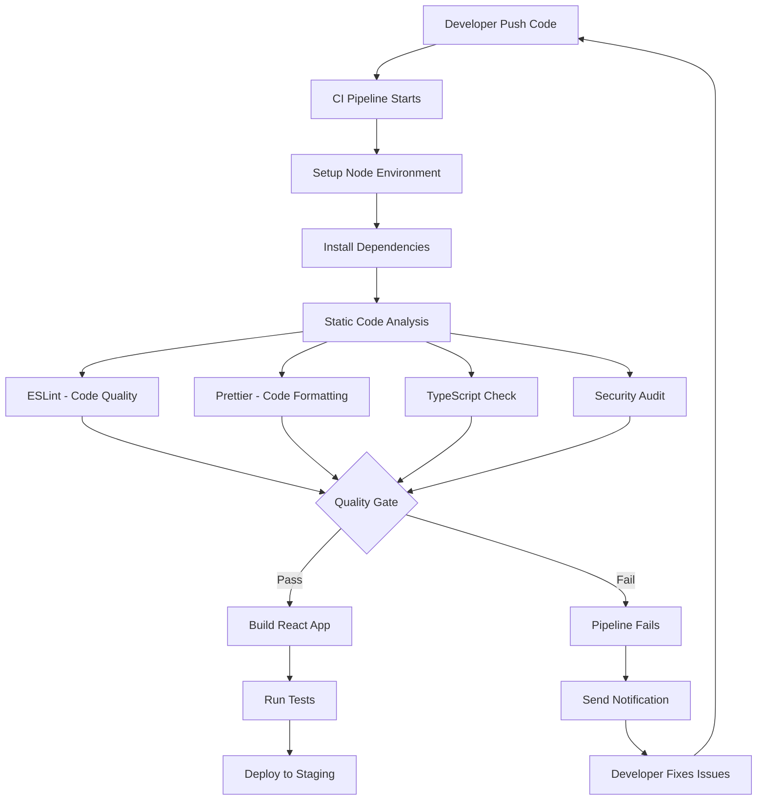

# Static Code Analysis for React CI/CD Pipeline

---

## Document Metadata 

| **Author**   | **Created on** | **Version** | **Last updated on** | **Level** | **Reviewer**  |
|--------------|----------------|-------------|---------------------|-----------|---------------|
|Ashutosh Kumar| 2025-08-13     | 1.0          | 2025-08-13         | Internal  |Siddharth Pawar/Sahil Gupta|

---

## Table of Contents
- [Introduction](#introduction)
- [What is Static Code Analysis?](#what-is-static-code-analysis)
- [Why Static Code Analysis?](#why-static-code-analysis)
- [Workflow Diagram](#workflow-diagram)
- [Popular Tools](#popular-tools)
- [Tool Comparison](#tool-comparison)
- [Advantages](#advantages)
- [Best Practices](#best-practices)
- [Recommendations & Conclusion](#recommendations--conclusion)
- [Proof of Concept (POC)](#proof-of-concept-poc)
- [Contact Information](#contact-information)
- [References](#references)

---

## Introduction

This documentation provides a comprehensive guide to implementing static code analysis in React applications within CI/CD pipelines. It covers various tools, best practices, and recommendations for maintaining high code quality standards in modern JavaScript/TypeScript development environments.

Static code analysis is essential for React development as it helps maintain code quality, enforces consistent patterns, identifies security vulnerabilities, and catches potential bugs in JavaScript/TypeScript code before they reach production.

---

## What is Static Code Analysis?

Static code analysis is the process of examining React/JavaScript/TypeScript source code without executing it to identify:
- **Code quality issues** (complexity, maintainability, readability)
- **JavaScript/TypeScript errors** (syntax errors, type mismatches)
- **Security vulnerabilities** (XSS, unsafe patterns, dependency vulnerabilities)
- **React-specific issues** (hooks usage, component patterns, performance)
- **Accessibility violations** (a11y compliance)
- **Unused code** (dead imports, unused variables)
- **Bundle size issues** (large dependencies, inefficient imports)
- **Performance anti-patterns** (unnecessary re-renders, memory leaks)

### Key Characteristics:
- Automated examination of React/JS/TS source code
- No code execution required
- Early detection of issues in development cycle
- Integration with modern build tools (Webpack, Vite, etc.)
- Support for JSX, ES6+, and TypeScript
- React-specific rule sets and patterns

---

## Why Static Code Analysis?

| Benefit Category | Benefit | Description |
|------------------|---------|-------------|
| **Business Benefits** | Reduced Development Costs | Early bug detection prevents costly production fixes |
| | Improved User Experience | Catches accessibility and performance issues early |
| | Enhanced Security | Identifies XSS vulnerabilities and unsafe patterns |
| | Faster Time to Market | Automated quality gates accelerate development |
| | Brand Protection | Prevents security breaches and performance issues |
| **Technical Benefits** | Automated Quality Assurance | Consistent code review for React components |
| | Component Reusability | Enforces consistent React patterns and practices |
| | Bundle Optimization | Identifies unused imports and large dependencies |
| | Type Safety | Catches type errors in TypeScript React applications |
| | Accessibility Compliance | Ensures React apps meet a11y standards |

---

## Workflow Diagram

---

## Popular Tools

| Tool | Description | Key Features | Pros | Cons |
|------|-------------|--------------|------|------|
| **ESLint** | Pluggable JavaScript and TypeScript linter with React support | React hooks rules, JSX syntax checking, Custom rule creation, IDE integration, Auto-fixing capabilities | Industry standard, React-specific rules, Highly configurable, Excellent IDE support | Configuration complexity, Can be slow, Rule conflicts |
| **Prettier** | Opinionated code formatter for JavaScript, TypeScript, and JSX | Automatic code formatting, Consistent style enforcement, Multiple format support, Editor integration, Git hooks support | Eliminates formatting debates, Very fast, Easy setup, Consistent results | Opinionated style, Limited customization, Not a code analyzer |
| **TypeScript Compiler** | Static type checker and compiler for JavaScript | Type error detection, Compile-time checking, Modern JavaScript features, Strong IDE integration, Gradual adoption | Strong type safety, Excellent tooling, Growing adoption, Prevents runtime errors | Learning curve, Additional build step, Migration effort |
| **npm audit / yarn audit** | Built-in security vulnerability scanner for dependencies | Dependency vulnerability detection, Automatic fix suggestions, Security advisory database, CI integration, Low overhead | Built into package managers, No additional setup, Comprehensive database, Easy automation | Limited to dependencies, No code analysis, False positives |
| **SonarQube CE** | Multi-language code quality platform with JavaScript/TypeScript support | Security vulnerability analysis, Code quality metrics, Technical debt tracking, React-specific rules, Web dashboard | Comprehensive analysis, Excellent reporting, Industry standard, Historical tracking | Resource intensive, Complex setup, Limited free features |
| **CodeQL** | Semantic code analysis engine by GitHub | Security vulnerability detection, Custom query language, Deep semantic analysis, GitHub integration, Enterprise security focus | Very accurate, Deep analysis, GitHub native, Advanced security | Complex setup, Steep learning curve, Primarily security focused |

---

## Tool Comparison

| Feature | ESLint | Prettier | TypeScript | npm/yarn audit | SonarQube | CodeQL |
|---------|--------|----------|------------|----------------|-----------|--------|
| **Cost** | Free | Free | Free | Free | Free (CE) | Free (Public repos) |
| **Code Quality** | ✅ | ❌ | ✅ | ❌ | ✅ | Limited |
| **Code Formatting** | Limited | ✅ | ❌ | ❌ | ❌ | ❌ |
| **Type Checking** | Basic | ❌ | ✅ | ❌ | Limited | ❌ |
| **Security Analysis** | Limited | ❌ | ❌ | ✅ | ✅ | ✅ |
| **React-Specific Rules** | ✅ | ✅ | ✅ | ❌ | ✅ | Limited |
| **Performance** | Fast | Very Fast | Medium | Fast | Medium | Slow |
| **Learning Curve** | Medium | Very Low | High | Low | Medium | High |
| **CI Integration** | Excellent | Excellent | Excellent | Excellent | Good | Good |
| **IDE Support** | Excellent | Excellent | Excellent | Good | Limited | Limited |

---

## Advantages

| Stakeholder | Advantage | Description |
|-------------|-----------|-------------|
| **React Developers** | Component Quality | Ensures React components follow best practices and patterns |
| | Accessibility Support | Automated a11y checking for inclusive applications |
| | Modern JavaScript | Enforces ES6+ and modern React patterns |
| | Type Safety | Catches type errors in TypeScript React projects |
| **Frontend Teams** | Consistent Styling | Automatic code formatting across all team members |
| | Performance Optimization | Identifies performance anti-patterns in React code |
| | Security Awareness | Detects XSS vulnerabilities and unsafe patterns |
| | Code Reusability | Promotes consistent component architecture |
| **Organizations** | User Experience | Better app performance and accessibility |
| | Security Compliance | Reduces risk of frontend security vulnerabilities |
| | Development Velocity | Faster code reviews and consistent quality |
| | Maintenance Costs | Easier maintenance of React applications |
| **CI/CD Pipelines** | Build Optimization | Catches issues before expensive build processes |
| | Deployment Safety | Prevents broken code from reaching production |
| | Automated Quality | Consistent quality checks without manual intervention |
| | Fast Feedback** | Quick analysis suitable for frequent deployments |

---

## Best Practices

| Category | Practice | Description |
|----------|----------|-------------|
| **Tool Setup** | Use Configuration Files | Store configs in .eslintrc, .prettierrc, tsconfig.json |
| | IDE Integration | Configure VS Code/WebStorm with same rules as CI |
| | Pre-commit Hooks | Run basic checks locally before pushing code |
| | Incremental Adoption | Start with basic rules, gradually add more strict ones |
| **React-Specific** | Hooks Rules | Enable React hooks ESLint rules for proper usage |
| | JSX Standards | Enforce consistent JSX formatting and patterns |
| | Component Patterns | Use rules for functional vs class components |
| | Accessibility | Include eslint-plugin-jsx-a11y for a11y compliance |
| **TypeScript Integration** | Gradual Migration | Introduce TypeScript checking incrementally |
| | Strict Mode | Enable strict TypeScript checking for new code |
| | Type Definitions | Ensure proper type definitions for props and state |
| | Interface Consistency | Use consistent interface naming and structure |
| **Security & Performance** | Dependency Scanning | Regular npm audit in CI pipeline |
| | Bundle Analysis | Monitor bundle size and dependencies |
| | Performance Rules | Include performance-focused ESLint rules |
| | Security Headers** | Validate security-related code patterns |
| **CI/CD Integration** | Fail Fast | Configure pipeline to fail on critical violations |
| | Parallel Execution | Run linting parallel with builds when possible |
| | Caching | Cache node_modules and analysis results |
| | Report Generation | Generate readable reports for team review |

---

## Recommendations & Conclusion

### Primary Recommendation: ESLint + Prettier + TypeScript + npm audit

| Aspect | Details |
|--------|---------|
| **Recommended Toolchain** | ESLint + Prettier + TypeScript + npm audit |
| **Target Use Case** | Learning, training, and professional React development |
| **Total Cost** | Free (all tools open source) |
| **Setup Time** | 45 minutes |
| **Learning Curve** | 2-3 weeks |

### Why This Combination

| Criteria | Justification |
|----------|---------------|
| **Comprehensive Coverage** | Code quality + Formatting + Type safety + Security |
| **Industry Standard** | Most adopted toolchain in React community |
| **React Optimized** | Specific support for React patterns and best practices |
| **Learning Value** | Teaches modern React, TypeScript, and security practices |
| **Free & Open Source** | No licensing costs, extensive community support |
| **Ecosystem Integration** | Native integration with React build tools and IDEs |

### Tool Roles

| Tool | Primary Purpose | React-Specific Benefits |
|------|----------------|------------------------|
| **ESLint** | Code quality and React rules | React hooks validation, JSX best practices, component patterns |
| **Prettier** | Code formatting | Consistent JSX formatting, team style consistency |
| **TypeScript** | Type checking | Props validation, state management, component contracts |
| **npm audit** | Dependency security | React library vulnerability scanning |

---

### Optional Additions

| Tool | When to Add | Benefit |
|------|-------------|---------|
| **SonarQube** | Enterprise projects | Centralized reporting, technical debt tracking |
| **Husky** | Team collaboration | Git hooks for automated local checking |
| **lint-staged** | Performance optimization | Run linting only on changed files |

**Final Recommendation**: The **ESLint + Prettier + TypeScript + npm audit** combination provides the optimal balance of React-specific analysis, modern development practices, and security for both learning and professional React development environments.

---

## **Proof of Concept (POC)**

Follow this link for "Static Code Analysis for React CI Checks" POC.
  > [Static Code Analysis for React CI Checks POC](https://github.com/Snaatak-Cloudops-Crew/documentation/blob/SCRUM-135-Ashutosh/Application-CI-Design/Generic-CI-operation/Licence-Scanning/POC.md)

---

## Contact Information

| Name            | Email Address                         |
|-----------------|---------------------------------------|
| Ashutosh Kumar  | ashutosh.kumar.snaatak@mygurukulam.co |

---

## References

| Reference | Description |
|-----------|-------------|
| [ESLint Documentation](https://eslint.org/docs/) | Complete guide to ESLint configuration and React-specific rules |
| [Prettier Documentation](https://prettier.io/docs/) | Official documentation for JavaScript/TypeScript code formatter |
| [TypeScript Documentation](https://www.typescriptlang.org/docs/) | Comprehensive TypeScript guide with React integration |
| [React ESLint Plugin](https://github.com/jsx-eslint/eslint-plugin-react) | React-specific ESLint rules and best practices |
| [React Hooks ESLint Plugin](https://www.npmjs.com/package/eslint-plugin-react-hooks) | ESLint rules for React Hooks usage patterns |
