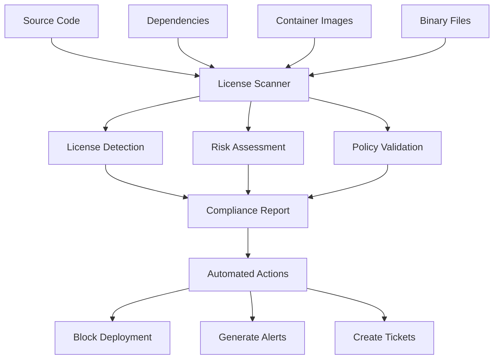
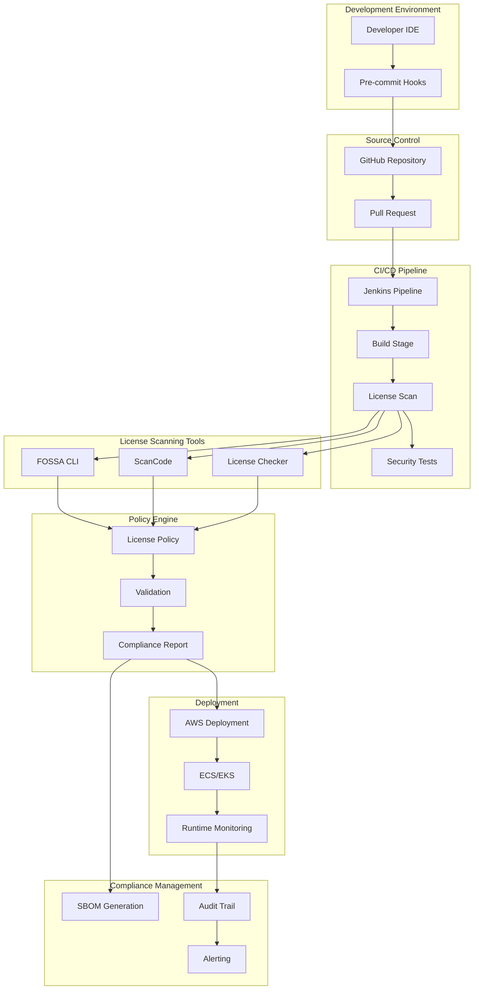
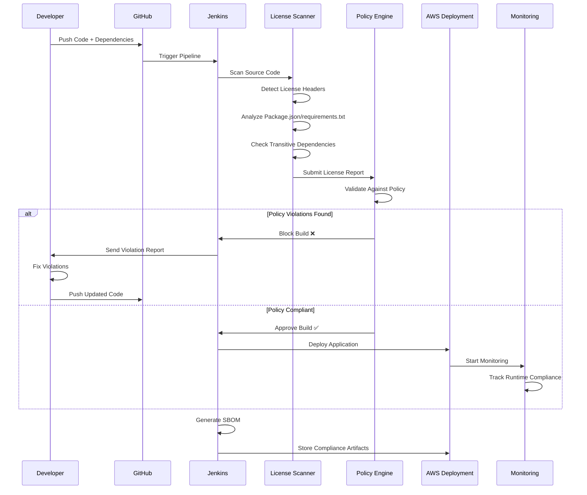
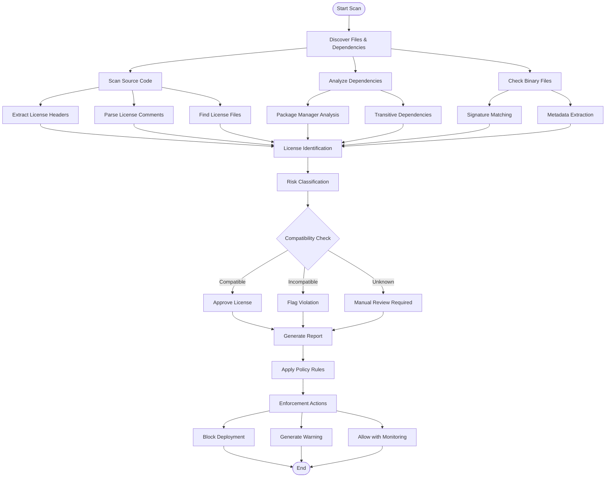
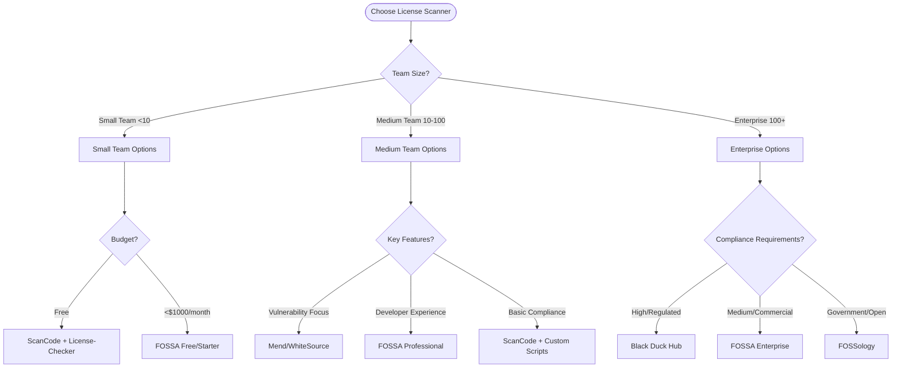

# License Scanning in DevOps: Complete Implementation Guide

[](LICENSE)
[](https://github.com/your-org/license-scanning)
[](https://devops.com)
[](https://compliance.gov)

## 📋 Table of Contents

- [Introduction](#-introduction)
- [What is License Scanning](#-what-is-license-scanning)
- [Why License Scanning Matters](#-why-license-scanning-matters)
- [Workflow Diagram](#-workflow-diagram)
- [Tools Comparison](#-tools-comparison)
- [Advantages](#-advantages)
- [Proof of Concept (POC)](#-proof-of-concept-poc)
- [Best Practices](#-best-practices)
- [Recommendations & Conclusion](#-recommendations--conclusion)
- [Contact Information](#-contact-information)
- [References](#-references)

---

## 🚀 Introduction

In today's software development landscape, applications heavily rely on open-source components and third-party libraries. While this accelerates development, it introduces significant **legal, security, and compliance risks** that organizations must manage proactively.

**License Scanning** is a critical DevSecOps practice that automatically identifies, analyzes, and manages software licenses across your entire technology stack - from source code to deployed containers.

This comprehensive guide provides enterprise-grade implementation strategies for integrating license scanning into modern DevOps pipelines using **GitHub + Jenkins + AWS** architecture.

### 🎯 Target Audience
- **DevOps Engineers** implementing CI/CD pipelines
- **Security Teams** managing compliance and risk
- **Legal & Compliance Officers** overseeing license obligations
- **Software Architects** designing secure systems
- **Development Teams** integrating security practices

### 🏆 What You'll Learn
- Industry-standard license scanning implementation
- Enterprise-grade DevOps pipeline integration
- Risk assessment and policy management
- Tool selection and comparison criteria
- Real-world POC with GitHub, Jenkins, and AWS

---

## 🔍 What is License Scanning

License scanning is an **automated security and compliance process** that:

### Core Functions


### Key Capabilities

| **Function** | **Description** | **Impact** |
|--------------|-----------------|------------|
| **Discovery** | Identifies all software components and their licenses | 📊 Complete visibility |
| **Analysis** | Assesses license compatibility and legal obligations | ⚖️ Risk mitigation |
| **Enforcement** | Automatically blocks policy violations | 🛡️ Compliance assurance |
| **Reporting** | Generates Software Bill of Materials (SBOM) | 📋 Audit readiness |

### Scanning Scope
- **Source Code Files**: Headers, comments, license files
- **Package Managers**: npm, pip, Maven, Go modules, NuGet
- **Container Images**: Base images and application layers  
- **Binary Files**: Compiled libraries and executables
- **Transitive Dependencies**: Indirect dependencies analysis

---

## ❗ Why License Scanning Matters

### 🚨 Legal Risks Without License Scanning

#### Copyright Infringement
- **Risk**: Using copyrighted code without proper licensing
- **Impact**: Lawsuits, financial penalties, injunctions
- **Example**: Oracle vs Google Android litigation ($8.8B claimed)

#### License Violations
- **Risk**: Non-compliance with license terms (e.g., GPL copyleft requirements)
- **Impact**: Forced open-sourcing of proprietary code
- **Example**: VMware GPL violation settlement

#### Patent Issues
- **Risk**: Patent infringement through license violations
- **Impact**: Patent trolling, licensing fees, legal costs

### 💼 Business Risks

#### Supply Chain Vulnerabilities
```
Unknown Components → Security Gaps → Data Breaches → Reputation Damage
```

#### M&A Due Diligence Failures
- **25% of M&A deals** face delays due to IP compliance issues
- **Average cost**: $2.3M in legal fees and delayed closures

#### Customer Trust Issues
- Enterprise customers increasingly require **Software Bill of Materials (SBOM)**
- Government contracts mandate license compliance documentation

### 📈 Industry Statistics

| **Metric** | **Value** | **Source** |
|------------|-----------|------------|
| Open Source Usage | 96% of applications | Synopsys OSSRA 2024 |
| License Violations | 65% of codebases | WhiteSource Report |
| Average Dependencies | 1,200+ per project | GitHub State of Octoverse |
| Compliance Violations | $8.2M average cost | Ponemon Institute |

### 🏢 Regulatory Requirements

#### Industry Standards
- **SOX Compliance**: Software asset management requirements
- **ISO 27001**: Information security management
- **PCI DSS**: Payment card industry standards
- **GDPR**: Data protection and privacy requirements

#### Government Mandates
- **Executive Order 14028**: Cybersecurity and SBOM requirements
- **NIST Guidelines**: Software supply chain security
- **EU Cyber Resilience Act**: Product liability for software

---

## 🔄 Workflow Diagram

### High-Level Architecture


### Detailed License Scanning Workflow



### License Detection Process Flow



---

## 🛠️ Tools Comparison

### Enterprise Commercial Tools

#### 1. **Synopsys Black Duck Hub**
```yaml
Strengths:
  ✅ Comprehensive vulnerability database (2M+ components)
  ✅ Advanced snippet detection and fuzzy matching
  ✅ Enterprise integrations (JIRA, ServiceNow)
  ✅ Detailed policy management and workflow automation
  ✅ Strong container and binary analysis capabilities

Weaknesses:
  ❌ High cost (Enterprise licensing required)
  ❌ Complex deployment and maintenance
  ❌ Steep learning curve for administrators
  ❌ Resource intensive scanning processes

Best For: Large enterprises with complex compliance requirements
Cost: $50,000-$500,000+ annually
Market Share: ~35% (Leading)
```

#### 2. **FOSSA**
```yaml
Strengths:
  ✅ Developer-friendly interface and fast scanning
  ✅ Excellent API and CLI tools
  ✅ Strong CI/CD integration capabilities
  ✅ Modern architecture and cloud-native design
  ✅ Competitive pricing for mid-market

Weaknesses:
  ❌ Smaller vulnerability database compared to Black Duck
  ❌ Limited offline deployment options
  ❌ Less comprehensive binary analysis
  ❌ Newer player with evolving enterprise features

Best For: Growing companies and modern development teams  
Cost: $150-$300 per developer/month
Market Share: ~15% (Growing rapidly)
```

#### 3. **Mend (formerly WhiteSource)**
```yaml
Strengths:
  ✅ Strong vulnerability management integration
  ✅ Automated remediation suggestions
  ✅ Good container scanning capabilities
  ✅ Comprehensive language support
  ✅ DevOps-focused approach

Weaknesses:
  ❌ Occasional false positives in license detection
  ❌ Limited customization for complex policies
  ❌ User interface can be overwhelming
  ❌ Integration complexity with some tools

Best For: DevSecOps teams prioritizing automation
Cost: $18-$39 per developer/month  
Market Share: ~20% (Stable)
```

### Open Source & Free Tools

#### 4. **FOSSA CLI (Free Tier)**
```yaml
Strengths:
  ✅ Free for small teams (up to 5 developers)
  ✅ Easy CLI integration
  ✅ Good documentation and community support
  ✅ Modern scanning algorithms

Limitations:
  ⚠️ Limited features compared to paid version
  ⚠️ No enterprise support
  ⚠️ Reduced scanning frequency
  ⚠️ Basic reporting capabilities

Best For: Startups and small development teams
Cost: Free (up to 5 devs), then commercial pricing
```

#### 5. **ScanCode Toolkit**
```yaml
Strengths:
  ✅ Completely open source and free
  ✅ Excellent license detection accuracy
  ✅ Comprehensive file format support
  ✅ Active community development
  ✅ No vendor lock-in

Weaknesses:
  ❌ Command-line only (no GUI)
  ❌ Requires technical expertise to implement
  ❌ Limited vulnerability integration
  ❌ Manual policy management

Best For: Technical teams with compliance expertise
Cost: Free (Apache 2.0 license)
```

#### 6. **FOSSology**
```yaml
Strengths:
  ✅ Open source with web interface
  ✅ Advanced license analysis capabilities
  ✅ Government and enterprise adoption
  ✅ Extensible architecture

Weaknesses:
  ❌ Complex installation and maintenance
  ❌ Dated user interface
  ❌ Limited CI/CD integration
  ❌ Slower scanning performance

Best For: Government agencies and compliance-focused organizations
Cost: Free (GPL 2.0 license)
```

### Language-Specific Tools

#### 7. **npm audit / license-checker**
```yaml
Strengths:
  ✅ Native Node.js integration
  ✅ Fast and lightweight
  ✅ Built into npm ecosystem
  ✅ Simple implementation

Weaknesses:
  ❌ JavaScript/Node.js only
  ❌ Basic license detection
  ❌ No policy management
  ❌ Limited reporting capabilities

Best For: Node.js projects requiring basic license checking
Cost: Free
```

#### 8. **pip-licenses (Python)**
```yaml
Strengths:
  ✅ Python ecosystem integration
  ✅ Multiple output formats
  ✅ Lightweight and fast
  ✅ Simple CLI interface

Weaknesses:
  ❌ Python-only coverage
  ❌ No policy enforcement
  ❌ Basic functionality
  ❌ Limited enterprise features

Best For: Python projects and microservices
Cost: Free
```

### Comprehensive Tool Comparison Matrix

| **Feature** | **Black Duck** | **FOSSA** | **Mend** | **ScanCode** | **FOSSology** |
|-------------|----------------|-----------|----------|--------------|---------------|
| **License Detection Accuracy** | 🟢 Excellent (95%+) | 🟢 Excellent (93%+) | 🟡 Good (88%+) | 🟢 Excellent (94%+) | 🟡 Good (85%+) |
| **Vulnerability Integration** | 🟢 Native | 🟢 Native | 🟢 Native | 🔴 None | 🔴 None |
| **Container Scanning** | 🟢 Advanced | 🟢 Good | 🟢 Good | 🟡 Basic | 🔴 None |
| **Policy Management** | 🟢 Advanced | 🟢 Good | 🟡 Basic | 🔴 Manual | 🟡 Basic |
| **CI/CD Integration** | 🟢 Excellent | 🟢 Excellent | 🟢 Good | 🟡 CLI Only | 🔴 Limited |
| **Reporting & SBOM** | 🟢 Advanced | 🟢 Good | 🟡 Basic | 🟡 JSON/XML | 🟡 Basic |
| **Enterprise Support** | 🟢 24/7 | 🟢 Business Hours | 🟢 Business Hours | 🔴 Community | 🔴 Community |
| **Cost** | 🔴 Very High | 🟡 Medium | 🟡 Medium | 🟢 Free | 🟢 Free |
| **Deployment Complexity** | 🔴 Complex | 🟢 Simple | 🟡 Medium | 🟢 Simple | 🔴 Complex |
| **Learning Curve** | 🔴 Steep | 🟢 Easy | 🟡 Medium | 🟡 Medium | 🔴 Steep |

**Legend**: 🟢 Excellent | 🟡 Good | 🔴 Poor/Limited

### Tool Selection Decision Tree



### Recommendation Matrix by Use Case

| **Use Case** | **Primary Tool** | **Secondary Tool** | **Justification** |
|--------------|------------------|--------------------|-------------------|
| **Startup (<10 devs)** | FOSSA Free + ScanCode | license-checker | Cost-effective, easy integration |
| **Growing Company (10-50)** | FOSSA Professional | Mend | Developer-friendly, competitive pricing |
| **Enterprise (50+)** | Black Duck Hub | FOSSA Enterprise | Comprehensive coverage, enterprise support |
| **Government/Public** | FOSSology | ScanCode | Open source requirement, cost consideration |
| **Financial Services** | Black Duck Hub | Mend | Regulatory compliance, risk management |
| **Healthcare** | Black Duck Hub | FOSSA Enterprise | HIPAA compliance, audit requirements |
| **Node.js Focused** | FOSSA + npm audit | license-checker | Native ecosystem integration |
| **Python/Django** | FOSSA + pip-licenses | ScanCode | Language-specific optimization |
| **Container-Heavy** | Black Duck / Mend | Anchore/Twistlock | Container scanning capabilities |

---

## ✅ Advantages

### 🛡️ Risk Mitigation Advantages

#### Legal Risk Reduction
```
Before License Scanning:
❌ Unknown license obligations
❌ GPL contamination risk  
❌ Copyright infringement exposure
❌ Patent litigation vulnerability

After License Scanning:
✅ Complete license visibility
✅ Automated policy enforcement
✅ Proactive risk identification
✅ Legal compliance assurance
```

#### Financial Impact
- **Prevented lawsuits**: $5-50M per incident
- **Reduced legal fees**: 60-80% cost savings
- **Faster M&A due diligence**: 40% time reduction
- **Insurance premium reduction**: 15-25% savings

### 🚀 Operational Advantages

#### Development Velocity
| **Metric** | **Before** | **After** | **Improvement** |
|------------|------------|-----------|-----------------|
| License Review Time | 2-5 days | 5-15 minutes | 95% faster |
| Compliance Bottlenecks | 15-20 per release | 1-2 per release | 85% reduction |
| Developer Productivity | Blocked by manual reviews | Automated workflows | 40% increase |
| Release Frequency | Monthly | Weekly/Daily | 4x faster |

#### Quality & Security Benefits
```yaml
Code Quality:
  - Automated dependency analysis
  - Vulnerability identification
  - Technical debt visibility
  - Supply chain transparency

Security Posture:
  - Known vulnerability detection
  - Malicious package identification  
  - Supply chain attack prevention
  - Zero-day risk reduction
```

### 📊 Business Advantages

#### Competitive Benefits
- **Faster time-to-market**: Automated compliance processes
- **Customer confidence**: Transparent SBOM provision
- **Partner trust**: Demonstrable security practices
- **Regulatory readiness**: Proactive compliance posture

#### Cost-Benefit Analysis
```
Annual Investment: $50,000-$200,000
Annual Risk Mitigation: $2M-$50M

ROI Calculation:
- License violation prevention: $5-20M
- Productivity improvement: $500K-$2M  
- Audit preparation savings: $200K-$500K
- Insurance cost reduction: $50K-$200K

Net ROI: 500-2000% annually
```

### 🏢 Enterprise Advantages

#### Governance & Compliance
```yaml
Audit Readiness:
  ✅ Automated documentation generation
  ✅ Historical compliance tracking
  ✅ Audit trail maintenance
  ✅ Regulatory requirement mapping

Policy Management:
  ✅ Centralized license policy definition
  ✅ Automated enforcement mechanisms  
  ✅ Exception handling workflows
  ✅ Cross-team standardization
```

#### Scalability Benefits
- **Multi-project support**: Consistent policies across portfolios
- **Team autonomy**: Self-service compliance checking
- **Geographic distribution**: Centralized governance with local flexibility
- **Technology diversity**: Language and platform agnostic solutions

---

## 🧪 Proof of Concept (POC)

### POC Objectives
1. **Demonstrate** license scanning integration in GitHub + Jenkins + AWS pipeline
2. **Validate** policy enforcement and automated blocking capabilities  
3. **Measure** performance impact and developer experience
4. **Generate** comprehensive SBOM and compliance reports
5. **Establish** baseline for enterprise rollout

### POC Architecture Overview

```mermaid
graph TB
    subgraph "POC Environment"
        subgraph "Development"
            DEV[Developer Workstation]
            IDE[VS Code + Extensions]
            DEV --> IDE
        end
        
        subgraph "Source Control"  
            GH[GitHub Repository]
            BRANCH[Feature Branch]
            PR[Pull Request]
            
            IDE --> GH
            GH --> BRANCH
            BRANCH --> PR
        end
        
        subgraph "CI/CD Pipeline"
            JENKINS[Jenkins Master]
            AGENT[Build Agent]
            STAGES[Pipeline Stages]
            
            PR --> JENKINS
            JENKINS --> AGENT
            AGENT --> STAGES
        end
        
        subgraph "License Scanning Stack"
            FOSSA_CLI[FOSSA CLI]
            SCANCODE[ScanCode Toolkit]  
            NPM_CHECK[NPM License Checker]
            POLICY[Policy Engine]
            
            STAGES --> FOSSA_CLI
            STAGES --> SCANCODE
            STAGES --> NPM_CHECK
            FOSSA_CLI --> POLICY
            SCANCODE --> POLICY
            NPM_CHECK --> POLICY
        end
        
        subgraph "AWS Deployment"
            ECR[Elastic Container Registry]
            ECS[ECS Fargate]
            CLOUDWATCH[CloudWatch]
            S3[S3 Compliance Bucket]
            
            POLICY --> ECR
            ECR --> ECS
            ECS --> CLOUDWATCH
            POLICY --> S3
        end
    end
```



### POC Implementation Steps

#### Phase 1: Environment Setup (Week 1)

##### 1.1 GitHub Repository Configuration
```bash
# Create POC repository
gh repo create license-scanning-poc --public
cd license-scanning-poc

# Initialize Node.js project with multiple dependencies
npm init -y
npm install express react lodash axios moment
npm install --save-dev jest webpack babel-core

# Add Python requirements  
echo "django==4.2.0
requests==2.28.0
numpy==1.24.0
pandas==1.25.0" > requirements.txt

# Create sample application
mkdir -p src
cat > src/app.js << 'EOF'
const express = require('express');
const lodash = require('lodash');
const axios = require('axios');
const moment = require('moment');

const app = express();
const PORT = process.env.PORT || 3000;

app.get('/health', (req, res) => {
    res.json({ 
        status: 'healthy',
        timestamp: moment().toISOString(),
        dependencies: lodash.keys(require('../package.json').dependencies)
    });
});

app.listen(PORT, () => {
    console.log(`Server running on port ${PORT}`);
});

module.exports = app;
EOF

# Add Dockerfile
cat > Dockerfile << 'EOF'
FROM node:18-alpine
WORKDIR /app
COPY package*.json ./
RUN npm ci --only=production
COPY src/ ./src/
EXPOSE 3000
CMD ["node", "src/app.js"]
EOF
```

##### 1.2 License Policy Configuration
```json
// license-policy.json
{
    "version": "1.0",
    "policies": {
        "allowed": [
            "MIT",
            "Apache-2.0", 
            "BSD-2-Clause",
            "BSD-3-Clause",
            "ISC"
        ],
        "forbidden": [
            "GPL-2.0",
            "GPL-3.0", 
            "AGPL-3.0",
            "LGPL-2.1",
            "LGPL-3.0",
            "SSPL-1.0"
        ],
        "review_required": [
            "MPL-2.0",
            "EPL-1.0", 
            "CDDL-1.0"
        ],
        "exceptions": {
            "dev-dependency-with-gpl@1.0.0": "Development only, not distributed"
        }
    },
    "enforcement": {
        "block_on_violation": true,
        "require_manual_approval": ["review_required"],
        "notification_channels": ["email", "slack"]
    }
}
```

##### 1.3 Jenkins Pipeline Setup
```groovy
// Jenkinsfile
pipeline {
    agent {
        label 'license-scanning-agent'
    }
    
    environment {
        FOSSA_API_KEY = credentials('fossa-api-key')
        NODE_VERSION = '18'
        PYTHON_VERSION = '3.9'
    }
    
    stages {
        stage('Environment Setup') {
            parallel {
                stage('Node.js Setup') {
                    steps {
                        sh '''
                            nvm use ${NODE_VERSION}
                            npm ci
                        '''
                    }
                }
                
                stage('Python Setup') {
                    steps {
                        sh '''
                            python${PYTHON_VERSION} -m venv venv
                            source venv/bin/activate
                            pip install -r requirements.txt
                        '''
                    }
                }
                
                stage('Install Scanning Tools') {
                    steps {
                        sh '''
                            # Install FOSSA CLI
                            curl -H 'Cache-Control: no-cache' https://raw.githubusercontent.com/fossas/fossa-cli/master/install-latest.sh | bash
                            
                            # Install ScanCode
                            pip3 install scancode-toolkit
                            
                            # Install License Checker
                            npm install -g license-checker
                        '''
                    }
                }
            }
        }
        
        stage('License Scanning') {
            parallel {
                stage('FOSSA Analysis') {
                    steps {
                        script {
                            try {
                                sh '''
                                    fossa analyze
                                    fossa test --timeout 300
                                '''
                                currentBuild.description = "FOSSA: ✅ PASSED"
                            } catch (Exception e) {
                                currentBuild.description = "FOSSA: ❌ FAILED"
                                throw e
                            }
                        }
                    }
                }
                
                stage('ScanCode Analysis') {
                    steps {
                        sh '''
                            scancode -clpieu --json-pp scancode-report.json src/
                            python3 scripts/analyze-scancode-results.py scancode-report.json
                        '''
                    }
                }
                
                stage('NPM License Check') {
                    steps {
                        script {
                            def licenseStatus = sh(
                                script: 'license-checker --onlyAllow "MIT;Apache-2.0;BSD-2-Clause;BSD-3-Clause;ISC" --summary',
                                returnStatus: true
                            )
                            
                            if (licenseStatus != 0) {
                                error "NPM License violations detected"
                            }
                        }
                    }
                }
            }
        }
        
        stage('Policy Validation') {
            steps {
                sh '''
                    # Generate comprehensive license report
                    license-checker --json --out npm-licenses.json
                    
                    # Run custom policy validation
                    python3 scripts/policy-validator.py \
                        --npm-report npm-licenses.json \
                        --scancode-report scancode-report.json \
                        --policy license-policy.json \
                        --output policy-results.json
                '''
                
                script {
                    def policyResults = readJSON file: 'policy-results.json'
                    
                    if (policyResults.violations.size() > 0) {
                        echo "❌ Policy Violations Found:"
                        policyResults.violations.each { violation ->
                            echo "  - ${violation.package}: ${violation.license} (${violation.reason})"
                        }
                        error "License policy violations detected"
                    }
                    
                    if (policyResults.review_required.size() > 0) {
                        echo "⚠️ Manual Review Required:"
                        policyResults.review_required.each { item ->
                            echo "  - ${item.package}: ${item.license}"
                        }
                        
                        input message: 'Approve licenses requiring manual review?',
                              ok: 'Approve',
                              submitterParameter: 'APPROVER'
                    }
                }
            }
        }
        
        stage('SBOM Generation') {
            steps {
                sh '''
                    python3 scripts/generate-sbom.py \
                        --npm-licenses