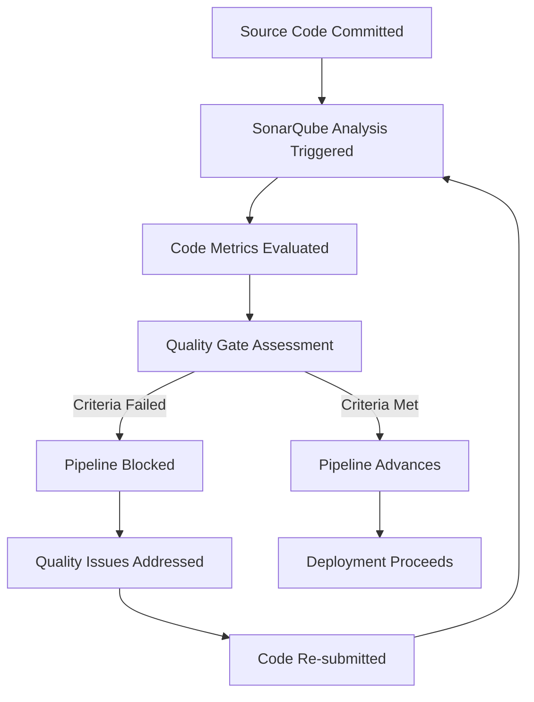

# SonarQube Quality Gates - Documentation 

---

## Document Metadata

| **Author**     | **Created on** | **Version** | **Last updated on** | **Level** | **Reviewer**    |
| -------------- | -------------- | ----------- | ------------------- | --------- | --------------- |
| Ashutosh Kumar | 2025-08-14     | 1.0         | 2025-08-14          | Internal  | Siddharth Pawar |

---
## Table of Contents

- [Introduction](#introduction)
- [What are Quality Gates?](#what-are-quality-gates)
- [Why Use Quality Gates?](#why-use-quality-gates)
- [Workflow Diagram](#workflow-diagram)
- [Identification of Quality Gates](#identification-of-quality-gates)
- [Default Quality Gates](#default-quality-gates)
- [Custom Quality Gates](#custom-quality-gates)
- [Advantages](#advantages)
- [Best Practices](#best-practices)
- [Conclusion](#conclusion)
- [Contact Information](#contact-information)
- [References](#references)

---

## Introduction

Quality Gates in **SonarQube** represent a fundamental approach to maintaining code quality standards across software development lifecycles. This comprehensive documentation explores the implementation, configuration, and optimization of Quality Gates to ensure robust code quality management in modern development environments. By establishing automated quality checkpoints, organizations can maintain consistent coding standards while accelerating development velocity.

---

## What are Quality Gates?

A **Quality Gate** functions as an automated quality checkpoint within SonarQube that evaluates source code against predefined quality criteria. These gates serve as gatekeepers in your development pipeline, analyzing code metrics and determining whether the codebase satisfies established quality thresholds before allowing progression to subsequent development stages.

Quality Gates operate by:
- Assessing code analysis results against configured conditions
- Providing binary pass/fail decisions based on metric evaluations  
- Blocking or allowing pipeline progression based on quality assessments
- Offering detailed feedback on specific quality violations

---

## Why Use Quality Gates?

| Rationale                      | Business Impact                                                                |
|-------------------------------|--------------------------------------------------------------------------------|
| **Standardization Enforcement** | Maintains consistent quality standards across all development initiatives.      |
| **Automated Quality Control**   | Reduces manual code review overhead through automated quality validation.       |
| **Risk Mitigation**            | Prevents defective code from progressing to production environments.           |
| **Developer Productivity**     | Provides immediate quality feedback, enabling faster issue resolution.         |
| **Technical Debt Management**  | Controls accumulation of technical debt through proactive quality measures.    |
| **Compliance Assurance**      | Supports regulatory compliance through documented quality enforcement.         |

Quality Gates transform quality assurance from a reactive process into a proactive development practice, ensuring quality is built into the software development lifecycle rather than added as an afterthought.

---

## Workflow Diagram



---

## Identification of Quality Gates

Quality Gates in **SonarQube** are identified and managed through the administrative interface, with visibility provided at multiple organizational levels.

### Location and Access

Navigate to Quality Gate settings via:

```
Project Dashboard → Quality Gates → Gate Configuration
```

### Quality Gate Visibility

- **Project Level**: Individual project dashboards display current Quality Gate status
- **Portfolio Level**: Aggregate quality metrics across multiple projects
- **Organization Level**: Enterprise-wide quality governance and reporting

### Status Indicators

| Indicator            | Description                                              |
| -------------------- | -------------------------------------------------------- |
| Visual Status Badges | Green (Passed) or Red (Failed) indicators                |
| Detailed Metrics     | Breakdown of all evaluated conditions                    |
| Historical Trends    | Tracks quality changes over time                         |
| Failure Analysis     | Shows specific conditions and thresholds causing failure |


---

## Default Quality Gates

SonarQube provides the **"Sonar way"** Quality Gate as the standard configuration, implementing industry-recognized quality practices optimized for new code evaluation.

### **Sonar way – Standard Configuration:**

| Quality Condition          | Required Threshold |
|----------------------------|-------------------|
| New Bug Count             | 0                 |
| New Vulnerability Count   | 0                 |
| New Code Coverage         | ≥ 80%             |
| Code Duplication Rate     | ≤ 3%              |
| Maintainability Rating    | A                 |
| Reliability Rating        | A                 |
| Security Rating           | A                 |

### Benefits of Default Configuration

| Advantage                | Description                                             |
| ------------------------ | ------------------------------------------------------- |
| Immediate Implementation | Ready-to-use configuration with no customization needed |
| Industry Standards       | Based on widely accepted software quality principles    |
| New Code Focus           | Prioritizes quality in recent code changes              |
| Balanced Approach        | Practical thresholds suitable for most projects         |


---

## Custom Quality Gates

Custom Quality Gates enable organizations to define **tailored quality criteria** that align with specific project requirements, organizational standards, and risk tolerance levels.

### Use Cases for Custom Gates

- **Legacy System Integration**: Gradual quality improvement for existing codebases
- **Industry-Specific Requirements**: Compliance with sector-specific quality standards  
- **Team Maturity Levels**: Quality thresholds appropriate to development team experience
- **Project Risk Profiles**: Stricter criteria for high-risk or critical applications

### Custom Gate Creation Process

1. **Access Administration Panel**:
   ```
   Administration → Quality Gates → Create Custom Gate
   ```

2. **Define Gate Properties**:
   - Provide descriptive gate name
   - Set organizational scope and visibility

3. **Configure Quality Conditions**:
   - Code coverage requirements (e.g., ≥ 90% for critical systems)
   - Security vulnerability thresholds
   - Technical debt ratios
   - Code complexity limits
   - Custom rule violations

4. **Apply Gate Assignment**:
   - Associate gate with specific projects
   - Configure inheritance rules for project hierarchies

### Advanced Customization Options

- **Condition Operators**: Greater than, less than, equal to comparisons
- **Metric Combinations**: Multiple condition requirements for comprehensive evaluation  
- **Severity Levels**: Different thresholds for warnings vs. failures
- **Time-based Conditions**: Quality improvements over specified periods

---

## Advantages

| **Strategic Benefit**           | **Technical Implementation**                                                                  |
| ------------------------------- | --------------------------------------------------------------------------------------------- |
| **Automated Quality Assurance** | Implements consistent quality validation without manual intervention or human error.          |
| **Continuous Feedback**         | Provides immediate quality assessment following each code analysis cycle.                     |
| **DevOps Integration**          | Seamlessly integrates with Jenkins, GitLab CI/CD, Azure DevOps, and other pipeline tools.   |
| **Configurable Standards**      | Enables fine-tuning of quality criteria based on project complexity and organizational needs. |
| **Security Enhancement**        | Enforces secure coding practices through automated vulnerability detection and blocking.      |
| **Scalable Implementation**     | Accommodates projects ranging from individual repositories to enterprise-wide portfolios.     |

---

## Best Practices

| **Best Practice**                   | **Implementation Strategy**                                                                    |
| ----------------------------------- | ---------------------------------------------------------------------------------------------- |
| **Realistic Threshold Setting**     | Establish achievable quality standards that promote improvement without hindering productivity. |
| **Fail-Fast Configuration**         | Configure gates to immediately halt builds when critical quality violations are detected.      |
| **Proactive Issue Management**      | Address quality warnings before they escalate to critical failures or security vulnerabilities. |
| **Regular Gate Maintenance**        | Periodically review and update quality criteria to reflect evolving project and business needs. |
| **Early Pipeline Integration**      | Position quality analysis at the beginning of CI/CD pipelines for rapid feedback cycles.       |
| **Metrics-Driven Improvement**      | Use quality gate data to identify improvement opportunities and track progress over time.       |
| **Exception Handling**             | Establish clear procedures for handling legitimate quality gate exceptions or emergency releases. |

---

## Conclusion


Quality Gates are automated checks that enforce coding standards and catch issues early in the development process. They can be customized or use defaults to fit project and organization needs, forming a flexible quality assurance framework. Integrating them into the workflow shifts quality control from an afterthought to a built-in step, helping teams deliver software that is secure, maintainable, reliable, and aligned with business goals.


---

## Contact Information


| **Name**       | **Email Address**                                                                     |
| -------------- | ------------------------------------------------------------------------------------- |
| Ashutosh Kumar | [ashutosh.kumar.snaatak@mygurukulam.co](mailto:ashutosh.kumar.snaatak@mygurukulam.co) |

---

## References

| Link                                                                                                            | Description                                |
| --------------------------------------------------------------------------------------------------------------- | ------------------------------------------ |
| [SonarQube Official Documentation](https://docs.sonarqube.org/latest/user-guide/quality-gates)                  | Quality Gates configuration guide          |
| [SonarSource Best Practices](https://www.sonarsource.com/resources/best-practices)                              | Quality Gate implementation strategies     |
| [Continuous Integration with Quality Gates](https://docs.sonarqube.org/latest/analysis/ci-integration-overview) | DevOps integration patterns                |
| [Quality Gate API Documentation](https://docs.sonarqube.org/latest/extend/web-api)                              | Programmatic configuration and management  |
| [Code Quality Metrics and Standards](https://www.sonarsource.com/learn/code-quality)                            | Industry quality benchmarks                |
